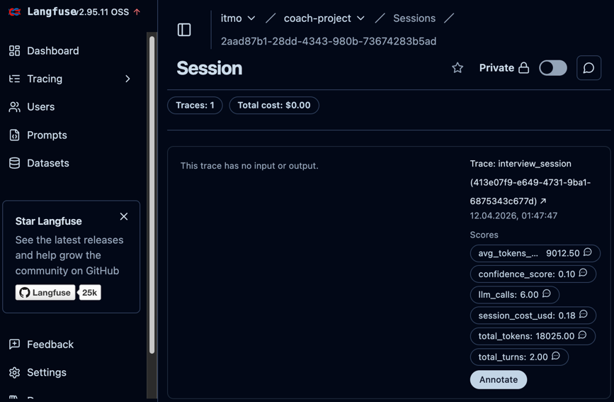
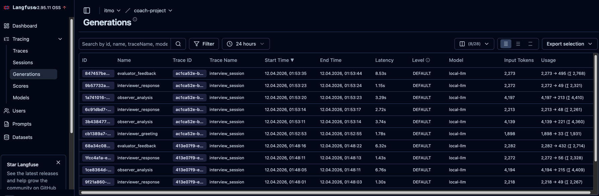
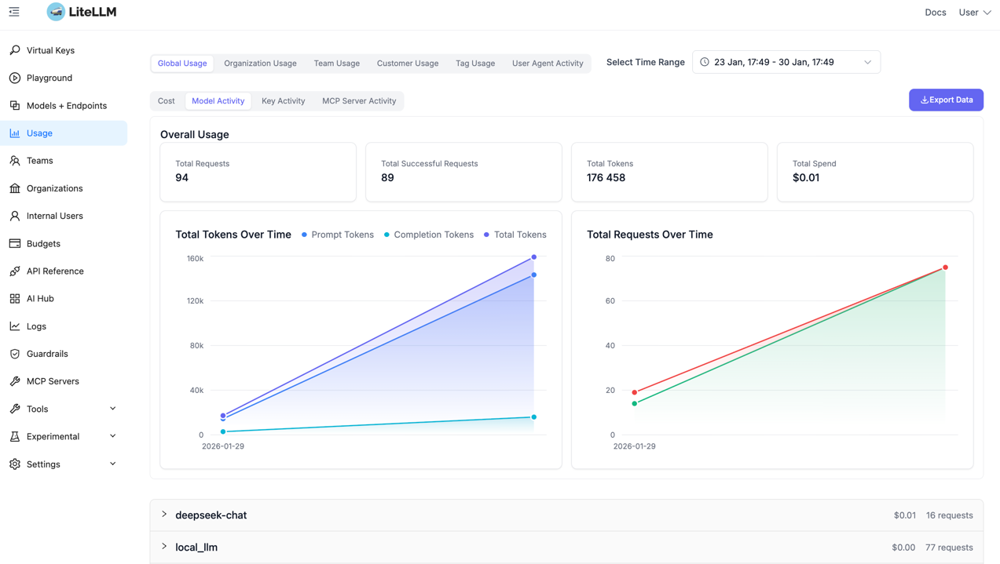
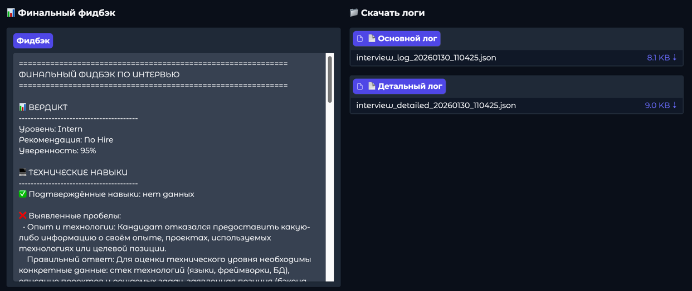

# Multi-Agent Interview Coach

Система технического интервью с мультиагентной логикой (Observer / Interviewer / Evaluator), FastAPI backend и
веб-интерфейсом на Gradio. Интеграция с LLM выполняется через LiteLLM proxy (OpenAI-compatible API). Для кэширования
используется Redis.

Дополнительно в проект включён **локальный Langfuse (self-hosted)** для observability: трекинг вызовов LLM,
трейсов интервью, метрик токенов и статистики сессии.

---

## Скриншот веб-интерфейса

<!-- SCREENSHOT:GRADIO_MAIN_UI -->


---

## Скриншоты демонстрации работы (Observability + результаты)

Ниже приведены ключевые экраны, демонстрирующие работу системы и сбор метрик.

### Langfuse — Sessions (метрики по интервью-сессиям)

<!-- SCREENSHOT:LANGFUSE_SESSIONS -->


### Langfuse — Generations (вызовы LLM и полезная диагностика)

<!-- SCREENSHOT:LANGFUSE_GENERATIONS -->


### LiteLLM — Usage (потребление токенов)

<!-- SCREENSHOT:LITELLM_USAGE -->


### Gradio — результаты после завершения интервью

<!-- SCREENSHOT:GRADIO_RESULTS -->


---

## Возможности

- Проведение технического интервью в чат-формате.
- Мультиагентный пайплайн:
    - анализ ответа кандидата (в т. ч. детекция галлюцинаций / off-topic / встречных вопросов),
    - генерация следующего вопроса с адаптацией сложности,
    - формирование финального структурированного фидбэка.
- Адаптивная сложность вопросов (BASIC → INTERMEDIATE → ADVANCED → EXPERT).
- Сохранение логов интервью:
    - основной лог по формату ТЗ,
    - детальный лог с внутренними мыслями агентов,
    - метрики токенов сессии (в детальном логе и в финальном фидбэке в UI).
- Observability через **Langfuse (локально)**:
    - трейсы интервью (greeting / user_message / observer_analysis / interviewer_response / final_feedback),
    - статистика токенов по сессии и по агентам,
    - диагностика LLM ошибок (generation end with error).
- Запуск через Docker Compose (Gradio + FastAPI backend + Redis + Nginx + Langfuse + PostgreSQL).
- Централизованная конфигурация через `.env` (pydantic-settings).
- Ротация логов приложения (system.log / personal.log).

---

## Дополнительные возможности стабильности диалога и качества оценки

- **Автоматическое извлечение данных о кандидате из текста.**
  Система извлекает из сообщений кандидата атрибуты профиля (имя, позиция, заявленный грейд, опыт, технологии) и
  сохраняет их в состоянии интервью для дальнейшей персонализации вопросов и логирования.

- **Уточнение недостающих данных.**
  Если критичная информация отсутствует (например, позиция/стек), интервью начинается с этапа представления и
  продолжает корректно собирать контекст, избегая нерелевантных вопросов.

- **Завершение интервью по распознаванию намерения пользователя.**
  Система распознаёт команды/намерение завершить интервью (например: «стоп», «давай фидбэк») и корректно переводит
  сессию в финализацию с генерацией итогового фидбэка и сохранением логов.

- **Сохранение «активного технического вопроса» при попытках смены темы.**
  При уходе от темы или попытках сменить технический вопрос система сохраняет якорь последнего активного вопроса и
  возвращает диалог к нему до получения ответа либо явного «не знаю».

- **Устойчивость к галлюцинациям за счёт проверки фактов.**
  При выявлении фактически неверных утверждений система маркирует их как ошибку, корректно сообщает правильную
  информацию и фиксирует пробелы в знаниях, не подменяя ответ кандидата.

---

## Архитектура

### Основные компоненты

- **Gradio UI** (`src/app/ui/gradio_app.py`): веб-интерфейс и управление сессией.
- **InterviewSession** (`src/app/interview/session.py`): оркестрация агентов, состояние интервью, лимиты ходов,
  генерация фидбэка, сбор метрик Langfuse.
- **Агенты** (`src/app/agents/*`): `ObserverAgent`, `InterviewerAgent`, `EvaluatorAgent`.
- **LLMClient** (`src/app/llm/client.py`): HTTP-клиент к LiteLLM proxy + трекинг generation в Langfuse.
- **LangfuseTracker** (`src/app/observability/langfuse_client.py`): трекинг трейсов/генераций и сбор метрик токенов.
- **FastAPI backend** (`src/app/main.py`, `src/app/core/setup.py`): приложение, middleware, документация.
- **Redis cache** (`src/app/utils/cache.py`): хранение connection pool и клиента.
- **Логирование** (`src/app/core/logger_setup.py`): форматтер с TZ, фильтры для system/personal логов, ротация.

### Поток обработки сообщения (высокоуровнево)

1. Пользователь отправляет сообщение в Gradio UI.
2. `InterviewSession.process_message()`:
    - записывает сообщение в последний `InterviewTurn`,
    - создаёт span `user_message` в Langfuse и увеличивает счётчик ходов,
    - передаёт сообщение в `ObserverAgent.process()` вместе с последним вопросом интервьюера.
3. `ObserverAgent` возвращает `ObserverAnalysis`:
    - тип ответа (normal / hallucination / off_topic / question / stop_command / introduction / incomplete / excellent),
    - качество ответа,
    - фактическую корректность,
    - извлечённые данные кандидата (опционально),
    - рекомендацию интервьюеру.
4. `InterviewSession` обновляет состояние:
    - `candidate` (name/grade/tech stack),
    - `covered_topics / confirmed_skills / knowledge_gaps`,
    - адаптирует `current_difficulty`,
    - пишет span `observer_analysis` и `difficulty_change` (если был).
5. `InterviewerAgent.process()` генерирует следующий ответ/вопрос и возвращает также внутренние мысли.
6. `InterviewSession` создаёт новый `InterviewTurn` с сообщением интервьюера и пишет span `interviewer_response`.
7. По команде остановки или лимиту ходов:
    - `EvaluatorAgent.process()` формирует `InterviewFeedback`,
    - пишется span `final_feedback`,
    - к трейсу добавляются финальные метрики (token metrics),
    - сохраняются логи.

---

## Агенты и взаимодействие

### BaseAgent

`src/app/agents/base.py`

- Общее для всех агентов:
    - `system_prompt` (абстрактное свойство),
    - сбор сообщений для LLM через `_build_messages()`,
    - единый асинхронный интерфейс `process(...)`.

### ObserverAgent (анализ кандидата)

`src/app/agents/observer.py`

Задачи:

- определение типа ответа кандидата:
    - технический ответ, неполный ответ, отличный ответ,
    - встречный вопрос (role reversal),
    - уход от темы (off-topic),
    - галлюцинация / фактическая ошибка,
    - команда завершения.
- извлечение информации о кандидате из текста: имя, позиция, грейд, опыт, технологии.
- выдача рекомендаций интервьюеру с маркерами:
    - `ANSWERED_LAST_QUESTION=YES|NO`
    - `NEXT_STEP=ASK_NEW_QUESTION|ASK_FOLLOWUP|REPEAT_LAST_QUESTION`
    - опционально `REASON=...`

Что задаётся в промпте (структурно, без текста):

- роль и миссия агента,
- правила классификации ответов и качества,
- правила детекции галлюцинаций и prompt injection,
- правила обработки встречных вопросов,
- требование сохранять «активный технический вопрос»,
- требование возвращать валидный JSON фиксированной схемы.

### InterviewerAgent (ведение интервью)

`src/app/agents/interviewer.py`

Задачи:

- ведение диалога и постановка ровно одного активного технического вопроса.
- адаптация поведения по рекомендациям Observer:
    - исправление галлюцинаций,
    - возврат с off-topic,
    - краткий ответ на встречный вопрос и возврат к активному вопросу,
    - уточняющие вопросы при неполном ответе,
    - усложнение при отличном ответе.
- соблюдение ограничения: вопросы только по технологиям, указанным кандидатом.

Что задаётся в промпте (структурно, без текста):

- роль и стиль общения,
- правила релевантности вопросов по стеку кандидата,
- правила «одного активного вопроса» (якоря),
- правила обработки hallucination/off-topic/question,
- правила безопасности (prompt injection),
- формат ответа (естественный текст, без JSON/markdown).

### EvaluatorAgent (финальный фидбэк)

`src/app/agents/evaluator.py`

Задачи:

- генерация финального `InterviewFeedback` в строгом JSON-формате:
    - вердикт (грейд, рекомендация по найму, уверенность),
    - технический обзор (подтверждённые навыки / пробелы),
    - soft skills (ясность, честность, вовлечённость),
    - персональный роадмап (темы, приоритеты, ресурсы),
    - общие комментарии.
- опора только на данные интервью (история диалога + сводка навыков).

Что задаётся в промпте (структурно, без текста):

- роль и миссия агента,
- структура фидбэка и строгий формат JSON,
- критерии оценки (включая галлюцинации как red flag),
- требования к стилю (конкретика и примеры из интервью),
- ограничения безопасности.

---

## Структура проекта

Ключевые директории:

- `src/app/agents/` — агенты (Observer/Interviewer/Evaluator) и общий базовый класс.
- `src/app/interview/` — сессия и логирование интервью.
- `src/app/llm/` — LLM клиент для LiteLLM.
- `src/app/observability/` — Langfuse tracker и метрики токенов сессии.
- `src/app/core/` — конфигурация, константы, логирование, setup FastAPI.
- `src/app/ui/` — Gradio интерфейс.
- `src/app/middleware/` — middleware (например client cache).
- `src/app/schemas/` — Pydantic модели интервью и фидбэка.

---

## Требования

- Python 3.11
- Docker / Docker Compose (для контейнерного запуска)
- Redis (используется в docker-compose)

---

## Конфигурация (.env)

Файл `.env.example` содержит полный перечень переменных окружения. Основные:

### LiteLLM (подключение приложения к прокси)

- `LITELLM_BASE_URL` — базовый URL LiteLLM proxy.
- `LITELLM_API_KEY` — ключ доступа к LiteLLM.
- `LITELLM_MODEL` — модель по умолчанию (значение `model_name` из конфигурации LiteLLM).
- `LITELLM_TIMEOUT` — таймаут запросов.
- `LITELLM_MAX_RETRIES` — количество повторных попыток.

### Интервью

- `INTERVIEW_LOG_DIR` — директория для логов интервью.
- `TEAM_NAME` — имя команды.
- `MAX_TURNS` — лимит ходов интервью.

### Redis

- `REDIS_CACHE_HOST`
- `REDIS_CACHE_PORT`

### Langfuse (self-hosted / локально)

- `LANGFUSE_ENABLED` — включить/выключить Langfuse трекинг.
- `LANGFUSE_HOST` — URL Langfuse для SDK:
    - в Docker Compose: `http://langfuse:3000`,
    - при локальном запуске без Compose: обычно `http://localhost:3000`.
- `LANGFUSE_PUBLIC_KEY`, `LANGFUSE_SECRET_KEY` — ключи Langfuse (создаются в UI: Settings → API Keys).
- Переменные контейнера Langfuse в `docker-compose.yml`:
    - `DATABASE_URL`, `NEXTAUTH_SECRET`, `NEXTAUTH_URL`, `SALT`, `TELEMETRY_ENABLED`.

### Приложение и логирование

- `APP_NAME`, `APP_DESCRIPTION`, `APP_VERSION`, `LICENSE_NAME`, `CONTACT_NAME`, `CONTACT_EMAIL`
- `CLIENT_CACHE_MAX_AGE` — max-age для `Cache-Control`.
- `APP_TZ_OFFSET` — смещение TZ для логов.
- `APP_LOG_DIR` — директория логов приложения.

---

## LiteLLM шлюз (llm-gateway-litellm)

В репозитории есть отдельный шлюз **LiteLLM** для OpenAI-compatible API маршрутизации к нескольким бэкендам (локальным
и облачным), с хранением конфигурации моделей и логов в PostgreSQL.

Директория: `llm-gateway-litellm/`

### Что поднимается

- **LiteLLM** (контейнер `litellm`) — OpenAI-compatible API + маршрутизация запросов + healthchecks.
- **PostgreSQL** (контейнер `litellm_db`) — хранение моделей/настроек/логов при включённом `STORE_MODEL_IN_DB`.

### Быстрый старт LiteLLM

```bash
cd llm-gateway-litellm
cp .env.example .env
docker compose up -d
curl -sS "http://localhost:${LITELLM_PORT_EXTERNAL}/health/liveliness"
```

Остановка:

```bash
docker compose down
```

### Основные переменные окружения LiteLLM

Файл `llm-gateway-litellm/.env.example` содержит полный набор параметров.

### Конфигурация моделей LiteLLM

Файл `llm-gateway-litellm/config.yaml` задаёт:

- `model_list` — список моделей (значения используются в поле `model` запросов).
- `general_settings.store_model_in_db: true` — хранить модели в БД.
- `litellm_settings` — таймауты и формат логов.

### Как подключить Interview Coach к LiteLLM шлюзу

1. Поднимите LiteLLM шлюз (см. шаги выше).
2. В корневом `.env` проекта укажите параметры подключения:

- `LITELLM_BASE_URL=http://localhost:4000` (или ваш `${LITELLM_PORT_EXTERNAL}`)
- `LITELLM_API_KEY=<LITELLM_MASTER_KEY>`
- `LITELLM_MODEL=local_llm` (или `cloud/deepseek-chat`, `cloud/deepseek-coder`, `cloud/deepseek-reasoner`)

---

## Запуск в Docker Compose

### 1) Подготовка `.env`

Скопировать пример и заполнить:

```bash
cp .env.example .env
```

Минимально для Langfuse:

- установите `LANGFUSE_ENABLED=true`,
- создайте API ключи в Langfuse UI и заполните `LANGFUSE_PUBLIC_KEY` / `LANGFUSE_SECRET_KEY`.

### 2) Запуск

```bash
docker compose up --build
```

### 3) Доступные сервисы (по умолчанию)

- **Gradio UI**: `http://localhost:${GRADIO_PORT}`
- **Nginx** (проксирует FastAPI backend): `http://localhost:${NGINX_EXTERNAL_PORT}`
- **FastAPI backend**: внутри сети compose (контейнер `backend`, порт `${BACKEND_PORT}`).
- **Redis**: внутри сети compose (контейнер `redis_cache`).
- **Langfuse UI**: `http://localhost:${LANGFUSE_PORT:-3000}`
- **Langfuse DB (PostgreSQL)**: внутри сети compose (контейнер `langfuse-db`).

---

## Langfuse (observability)

### Что трекается

В проекте добавлен self-hosted Langfuse для трекинга и метрик:

- trace на каждую сессию интервью (session_id),
- generation на каждый LLM вызов (observer/interviewer/evaluator),
- span’ы ключевых этапов:
    - `greeting`, `user_message`, `observer_analysis`, `interviewer_response`, `final_feedback`,
    - `difficulty_change` (если менялась сложность),
    - `session_token_metrics` (финальные метрики).
- score’ы на трейс:
    - `total_tokens`, `total_turns`, `llm_calls`, `avg_tokens_per_turn`,
    - `confidence_score` (вес: confidence_score/100).

### Где в коде

- `src/app/observability/langfuse_client.py` — `LangfuseTracker` + `SessionMetrics`.
- `src/app/llm/client.py` — создаёт Langfuse generation на каждый вызов LLM.
- `src/app/interview/session.py` — создаёт trace, добавляет span’ы и сохраняет метрики в лог.

### Как отключить

Установить `LANGFUSE_ENABLED=false`.
Также трекинг автоматически отключится, если ключи не заданы (см. логи старта приложения).

---

## Использование

### Через Gradio UI

1. Нажать «Начать интервью».
2. Представиться (имя, позиция/роль, опыт, технологии).
3. Отвечать на вопросы.
4. Ввести «стоп» для завершения и генерации фидбэка.

### Выходные артефакты

После завершения формируются файлы в `INTERVIEW_LOG_DIR`:

- `interview_log_YYYYMMDD_HHMMSS.json` — основной лог по формату ТЗ.
- `interview_detailed_YYYYMMDD_HHMMSS.json` — детальный лог с внутренними мыслями.
    - содержит `token_metrics` (суммарные токены, токены по агентам, средние значения).

В UI в финальный фидбэк дополнительно добавляется блок «📊 МЕТРИКИ СЕССИИ (ТОКЕНЫ)».

---

## Логирование

- Ротация файлов:
    - `system.log` — сообщения с `log_type=SYSTEM`.
    - `personal.log` — сообщения с `log_type=PERSONAL` и `ID:<request_id>`.
- Консольные логи включают внешние библиотеки с `log_type=EXTERNAL`.
- Временные метки форматируются в TZ, заданном `APP_TZ_OFFSET`.

---

## Разработка

### pre-commit

Репозиторий содержит `.pre-commit-config.yaml`:

- форматирование: `black`, `isort`
- линтинг: `flake8`
- типы: `mypy`
- проверка файлов: yaml/json/toml, trailing whitespace, debug statements и др.

Запуск:

```bash
pre-commit install
pre-commit run --all-files
```