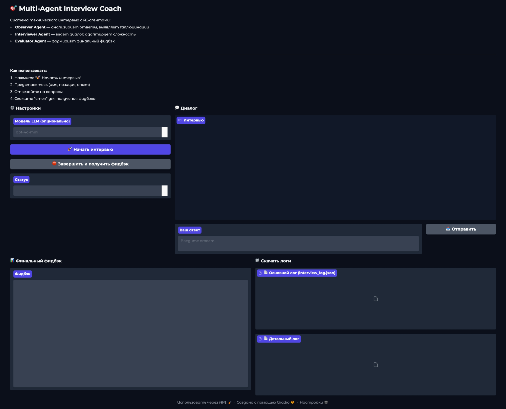

# Multi-Agent Interview Coach

Система технического интервью с мультиагентной логикой (Observer / Interviewer / Evaluator), FastAPI backend и
веб-интерфейсом на Gradio. Интеграция с LLM выполняется через LiteLLM proxy (OpenAI-compatible API). Для кэширования
используется Redis.

---

## Скриншот веб-интерфейса



---

## Возможности

- Проведение технического интервью в чат-формате.
- Мультиагентный пайплайн:
    - анализ ответа кандидата (в т. ч. детекция галлюцинаций / off-topic / встречных вопросов),
    - генерация следующего вопроса с адаптацией сложности,
    - формирование финального структурированного фидбэка.
- Адаптивная сложность вопросов (BASIC → INTERMEDIATE → ADVANCED → EXPERT).
- Сохранение логов интервью:
    - основной лог по формату ТЗ,
    - детальный лог с внутренними мыслями агентов.
- Запуск через Docker Compose (Gradio + FastAPI backend + Redis + Nginx).
- Централизованная конфигурация через `.env` (pydantic-settings).
- Ротация логов приложения (system.log / personal.log).

---

## Архитектура

### Основные компоненты

- **Gradio UI** (`src/app/ui/gradio_app.py`): веб-интерфейс и управление сессией.
- **InterviewSession** (`src/app/interview/session.py`): оркестрация агентов, состояние интервью, лимиты ходов,
  генерация фидбэка.
- **Агенты** (`src/app/agents/*`): `ObserverAgent`, `InterviewerAgent`, `EvaluatorAgent`.
- **LLMClient** (`src/app/llm/client.py`): HTTP-клиент к LiteLLM proxy.
- **FastAPI backend** (`src/app/main.py`, `src/app/core/setup.py`): приложение, middleware, документация.
- **Redis cache** (`src/app/utils/cache.py`): хранение connection pool и клиента.
- **Логирование** (`src/app/core/logger_setup.py`): форматтер с TZ, фильтры для system/personal логов, ротация.

### Поток обработки сообщения (высокоуровнево)

1. Пользователь отправляет сообщение в Gradio UI.
2. `InterviewSession.process_message()`:
    - записывает сообщение в последний `InterviewTurn`,
    - передаёт сообщение в `ObserverAgent.process()` вместе с последним вопросом интервьюера.
3. `ObserverAgent` возвращает `ObserverAnalysis`:
    - тип ответа (normal / hallucination / off_topic / question / stop_command / introduction / incomplete / excellent),
    - качество ответа,
    - фактическую корректность,
    - извлечённые данные кандидата (опционально),
    - рекомендацию интервьюеру.
4. `InterviewSession` обновляет состояние:
    - `candidate` (name/grade/tech stack),
    - `covered_topics / confirmed_skills / knowledge_gaps`,
    - адаптирует `current_difficulty`.
5. `InterviewerAgent.process()` генерирует следующий ответ/вопрос и возвращает также внутренние мысли.
6. `InterviewSession` создаёт новый `InterviewTurn` с сообщением интервьюера.
7. По команде остановки или лимиту ходов: `EvaluatorAgent.process()` формирует `InterviewFeedback`, сохраняются логи.

---

## Агенты и взаимодействие

### BaseAgent

`src/app/agents/base.py`

- Общее для всех агентов:
    - `system_prompt` (абстрактное свойство),
    - сбор сообщений для LLM через `_build_messages()`,
    - единый асинхронный интерфейс `process(...)`.

### ObserverAgent (анализ кандидата)

`src/app/agents/observer.py`

Задачи:

- определение типа ответа кандидата:
    - технический ответ, неполный ответ, отличный ответ,
    - встречный вопрос (role reversal),
    - уход от темы (off-topic),
    - галлюцинация / фактическая ошибка,
    - команда завершения.
- извлечение информации о кандидате из текста: имя, позиция, грейд, опыт, технологии.
- выдача рекомендаций интервьюеру с маркерами:
    - `ANSWERED_LAST_QUESTION=YES|NO`
    - `NEXT_STEP=ASK_NEW_QUESTION|ASK_FOLLOWUP|REPEAT_LAST_QUESTION`
    - опционально `REASON=...`

Что задаётся в промпте (структурно, без текста):

- роль и миссия агента,
- правила классификации ответов и качества,
- правила детекции галлюцинаций и prompt injection,
- правила обработки встречных вопросов,
- требование сохранять «активный технический вопрос»,
- требование возвращать валидный JSON фиксированной схемы.

### InterviewerAgent (ведение интервью)

`src/app/agents/interviewer.py`

Задачи:

- ведение диалога и постановка ровно одного активного технического вопроса.
- адаптация поведения по рекомендациям Observer:
    - исправление галлюцинаций,
    - возврат с off-topic,
    - краткий ответ на встречный вопрос и возврат к активному вопросу,
    - уточняющие вопросы при неполном ответе,
    - усложнение при отличном ответе.
- соблюдение ограничения: вопросы только по технологиям, указанным кандидатом.

Что задаётся в промпте (структурно, без текста):

- роль и стиль общения,
- правила релевантности вопросов по стеку кандидата,
- правила «одного активного вопроса» (якоря),
- правила обработки hallucination/off-topic/question,
- правила безопасности (prompt injection),
- формат ответа (естественный текст, без JSON/markdown).

### EvaluatorAgent (финальный фидбэк)

`src/app/agents/evaluator.py`

Задачи:

- генерация финального `InterviewFeedback` в строгом JSON-формате:
    - вердикт (грейд, рекомендация по найму, уверенность),
    - технический обзор (подтверждённые навыки / пробелы),
    - soft skills (ясность, честность, вовлечённость),
    - персональный роадмап (темы, приоритеты, ресурсы),
    - общие комментарии.
- опора только на данные интервью (история диалога + сводка навыков).

Что задаётся в промпте (структурно, без текста):

- роль и миссия агента,
- структура фидбэка и строгий формат JSON,
- критерии оценки (включая галлюцинации как red flag),
- требования к стилю (конкретика и примеры из интервью),
- ограничения безопасности.

---

## Структура проекта

Ключевые директории:

- `src/app/agents/` — агенты (Observer/Interviewer/Evaluator) и общий базовый класс.
- `src/app/interview/` — сессия и логирование интервью.
- `src/app/llm/` — LLM клиент для LiteLLM.
- `src/app/core/` — конфигурация, константы, логирование, setup FastAPI.
- `src/app/ui/` — Gradio интерфейс.
- `src/app/middleware/` — middleware (например client cache).
- `src/app/schemas/` — Pydantic модели интервью и фидбэка.

---

## Требования

- Python 3.11
- Docker / Docker Compose (для контейнерного запуска)
- Redis (используется в docker-compose)

---

## Конфигурация (.env)

Файл `.env.example` содержит полный перечень переменных окружения. Основные:

### LiteLLM

- `LITELLM_BASE_URL` — базовый URL LiteLLM proxy.
- `LITELLM_API_KEY` — ключ доступа (обязателен, если включена авторизация).
- `LITELLM_MODEL` — модель по умолчанию.
- `LITELLM_TIMEOUT` — таймаут запросов.
- `LITELLM_MAX_RETRIES` — количество повторных попыток.

### Интервью

- `INTERVIEW_LOG_DIR` — директория для логов интервью.
- `TEAM_NAME` — имя команды.
- `MAX_TURNS` — лимит ходов интервью.

### Redis

- `REDIS_CACHE_HOST`
- `REDIS_CACHE_PORT`

### Приложение и логирование

- `APP_NAME`, `APP_DESCRIPTION`, `APP_VERSION`, `LICENSE_NAME`, `CONTACT_NAME`, `CONTACT_EMAIL`
- `CLIENT_CACHE_MAX_AGE` — max-age для `Cache-Control`.
- `APP_TZ_OFFSET` — смещение TZ для логов.
- `APP_LOG_DIR` — директория логов приложения.

---

## Запуск в Docker Compose

### 1) Подготовка `.env`

Скопировать пример и заполнить:

```bash
cp .env.example .env
```

### 2) Запуск

```bash
docker compose up --build
```

### 3) Доступные сервисы (по умолчанию)

- **Gradio UI**: `http://localhost:${GRADIO_PORT}`
- **Nginx** (проксирует FastAPI backend): `http://localhost:${NGINX_EXTERNAL_PORT}`
- **FastAPI backend**: внутри сети compose (контейнер `backend`, порт `${BACKEND_PORT}`).
- **Redis**: внутри сети compose (контейнер `redis_cache`).

---

## Локальный запуск без Docker

Ниже приведён ориентир для запуска в окружении разработки.

### Установка зависимостей (Poetry)

```bash
poetry install
```

### Экспорт `.env` и запуск Gradio

```bash
export $(cat .env | xargs)
python -m app.gradio_main --host 0.0.0.0 --port 7860
```

### Запуск FastAPI

```bash
export $(cat .env | xargs)
uvicorn app.main:app --host 0.0.0.0 --port 8000
```

---

## Использование

### Через Gradio UI

1. Нажать «Начать интервью».
2. Представиться (имя, позиция/роль, опыт, технологии).
3. Отвечать на вопросы.
4. Ввести «стоп» для завершения и генерации фидбэка.

### Выходные артефакты

После завершения формируются файлы в `INTERVIEW_LOG_DIR`:

- `interview_log_YYYYMMDD_HHMMSS.json` — основной лог по формату ТЗ.
- `interview_detailed_YYYYMMDD_HHMMSS.json` — детальный лог с внутренними мыслями.

---

## Логирование

- Ротация файлов:
    - `system.log` — сообщения с `log_type=SYSTEM`.
    - `personal.log` — сообщения с `log_type=PERSONAL` и `ID:<request_id>`.
- Консольные логи включают внешние библиотеки с `log_type=EXTERNAL`.
- Временные метки форматируются в TZ, заданном `APP_TZ_OFFSET`.

---

## HTTP API и документация

FastAPI приложение собирается в `src/app/core/setup.py`:

- `docs_url/redoc_url/openapi_url` на уровне приложения отключены,
- отдельный `docs_router` добавляет маршруты:
    - `/docs`
    - `/redoc`
    - `/openapi.json`

Доступ к документации предполагается ограничивать через Nginx-конфигурацию (внешняя блокировка).

---

## Разработка

### pre-commit

Репозиторий содержит `.pre-commit-config.yaml`:

- форматирование: `black`, `isort`
- линтинг: `flake8`
- типы: `mypy`
- проверка файлов: yaml/json/toml, trailing whitespace, debug statements и др.

Запуск:

```bash
pre-commit install
pre-commit run --all-files
```

### Тесты

Конфигурация `pytest` описана в `pyproject.toml` (asyncio_mode=auto).  
Запуск:

```bash
pytest
```