# C4 Component — Ядро системы (InterviewSession + Agents)

Диаграмма описывает внутреннее устройство ядра системы: оркестратор `InterviewSession` и его взаимодействие с агентами, LLM-клиентом и вспомогательными компонентами.

---

## Диаграмма

```mermaid
C4Component
    title C4 Component — Interview Core (src/app)

    Container_Boundary(core, "Interview Core") {

        Component(session, "InterviewSession", "Python class", "Оркестратор сессии: lifecycle, последовательный вызов агентов, атомарные мутации состояния, адаптация сложности, интеграция с Langfuse")

        Component(state, "InterviewState", "Pydantic BaseModel", "In-memory состояние: candidate, turns, difficulty, skills, gaps, streaks")

        Component(observer, "ObserverAgent", "BaseAgent subclass", "Анализ ответа кандидата: классификация response_type, факт-чекинг, is_gibberish, answered_last_question, extracted_info")

        Component(interviewer, "InterviewerAgent", "BaseAgent subclass", "Генерация реплик: приветствие, вопросы, обработка сценариев (gibberish, hallucination, off-topic, question)")

        Component(evaluator, "EvaluatorAgent", "BaseAgent subclass", "Генерация финального InterviewFeedback: verdict, technical_review, soft_skills, roadmap")

        Component(base_agent, "BaseAgent", "ABC", "Абстрактный базовый класс: system_prompt, _build_messages(), _build_job_description_block()")

        Component(prompts, "Agent Prompts", "Final[str] constants", "Системные промпты: observer_prompt, interviewer_prompt, evaluator_prompt. Содержат role, rules, security, output_format")

        Component(llm_client, "LLMClient", "Python class", "HTTP-клиент к LiteLLM: complete(), complete_json(), retry с exponential backoff, Langfuse generation tracking, cost extraction")

        Component(circuit_breaker, "CircuitBreaker", "Python class", "Паттерн Circuit Breaker: CLOSED → OPEN → HALF_OPEN. Порог: 5 сбоев, recovery: 60s")

        Component(response_parser, "ResponseParser", "Module functions", "Многоуровневый парсер JSON из LLM: <r> → <result> → markdown code block → raw {...}. extract_reasoning()")

        Component(interview_logger, "InterviewLogger", "Python class", "Сохранение JSON-логов: interview_log (формат ТЗ) и interview_detailed (полный dump с token_metrics)")

        Component(langfuse_tracker, "LangfuseTracker", "Singleton", "Фасад над Langfuse SDK: create_trace, create_generation, add_span, score_trace, SessionMetrics")

        Component(session_metrics, "SessionMetrics", "Dataclass", "Агрегатор метрик: TokenUsage по агентам, turn_count, generation_count, cost_usd")

        Component(config, "Settings", "Pydantic Settings", "9 групп: App, Redis, Log, LiteLLM, Interview, Langfuse, GradioUI. Валидация, computed fields.")

        Component(schemas, "Schemas", "Pydantic Models", "InterviewTurn, ObserverAnalysis, InterviewFeedback, CandidateInfo, InterviewConfig, AgentSettings, enums")
    }

    Rel(session, observer, "Stage 1: process(state, user_message, last_question)")
    Rel(session, interviewer, "Stage 5: process(state, analysis, user_message)")
    Rel(session, evaluator, "generate_feedback: process(state)")
    Rel(session, state, "Reads/mutates: turns, difficulty, skills, gaps")
    Rel(session, interview_logger, "save_session(), save_raw_log()")
    Rel(session, langfuse_tracker, "create_trace, add_span, score_trace, add_session_metrics_to_trace")

    Rel(observer, base_agent, "extends")
    Rel(interviewer, base_agent, "extends")
    Rel(evaluator, base_agent, "extends")

    Rel(observer, prompts, "OBSERVER_SYSTEM_PROMPT")
    Rel(interviewer, prompts, "INTERVIEWER_SYSTEM_PROMPT")
    Rel(evaluator, prompts, "EVALUATOR_SYSTEM_PROMPT")

    Rel(base_agent, llm_client, "complete() / complete_json()")

    Rel(observer, response_parser, "extract_json_from_llm_response()")
    Rel(evaluator, response_parser, "extract_json_from_llm_response()")

    Rel(llm_client, circuit_breaker, "check(), record_success(), record_failure()")
    Rel(llm_client, langfuse_tracker, "create_generation(), end_generation()")
    Rel(llm_client, session_metrics, "Обновляет через end_generation(usage, cost)")

    Rel(session, config, "settings.MAX_TURNS, HISTORY_WINDOW_TURNS, etc.")
    Rel(session, schemas, "InterviewState, InterviewTurn, ObserverAnalysis, InterviewFeedback")

    UpdateRelStyle(session, observer, $offsetX="-80", $offsetY="-10")
    UpdateRelStyle(session, interviewer, $offsetX="10", $offsetY="-10")
    UpdateRelStyle(session, evaluator, $offsetX="90", $offsetY="-10")
```



---

## Описание компонентов

### InterviewSession (оркестратор)

Центральный компонент, координирующий весь пайплайн обработки сообщения:

1. Принимает `user_message` от UI.
2. Записывает сообщение в последний `InterviewTurn`.
3. Вызывает `ObserverAgent.process()` — Stage 1.
4. Идемпотентно обновляет `CandidateInfo` — Stage 2.
5. Проверяет стоп-команду — Stage 3.
6. Корректирует сложность (с snapshot для отката) — Stage 4.
7. Вызывает `InterviewerAgent.process()` — Stage 5. При сбое → откат difficulty.
8. Фиксирует неидемпотентные мутации (topics, skills, gaps) — Stage 6.

При завершении вызывает `EvaluatorAgent.process()` и сохраняет логи.

### Agents (Observer / Interviewer / Evaluator)

Все наследуются от `BaseAgent`, который предоставляет:

- `system_prompt` — абстрактное свойство, реализуемое каждым агентом;
- `_build_messages(user_content, history)` — формирование списка сообщений с правильным чередованием ролей;
- `_build_job_description_block(job_description)` — XML-блок описания вакансии.

**Observer** и **Evaluator** поддерживают `generation_retries` (default: 2) — повторные генерации при ошибке парсинга JSON. **Interviewer** не использует retry (`generation_retries=0`), т.к. генерирует свободный текст.

### LLMClient

- `complete()` — текстовый запрос с retry и backoff.
- `complete_json()` — JSON-запрос с fallback на текстовый режим при HTTP 400.
- `check_health()` — проверка `/health/readiness` перед стартом сессии.
- Интегрирован с `CircuitBreaker` для защиты от каскадных сбоев.
- Создаёт Langfuse `generation` на каждый вызов.

### ResponseParser

Четыре стратегии извлечения JSON (по убыванию приоритета):

1. `<r>...</r>` теги.
2. `<result>...</result>` теги.
3. Markdown code block (`` ```json ... ``` ``).
4. Сырой JSON-объект `{...}` с поиском сбалансированных скобок.

Также извлекает `<reasoning>...</reasoning>` блок для отладки.

### InterviewState

Pydantic `BaseModel` с мутабельными полями:

- `turns: list[InterviewTurn]` — полная история.
- `current_difficulty: DifficultyLevel` — BASIC/INTERMEDIATE/ADVANCED/EXPERT.
- `adjust_difficulty(analysis)` — детерминированный алгоритм на основе streak.
- `get_conversation_history(max_turns)` — формирует список `role/content` для LLM.

### SessionMetrics

Dataclass, агрегирующий:

- `TokenUsage` (input/output/total/cost) по каждому агенту (observer, interviewer, evaluator) и суммарно.
- `turn_count`, `generation_count`.
- Вычисляемые: `avg_tokens_per_turn`, `avg_tokens_per_generation`, `cost_per_turn`, `total_cost`.

Метрики добавляются в Langfuse trace как span и scores при завершении сессии, а также записываются в детальный JSON-лог.