# C4 Container Diagram — Multi-Agent Interview Coach

Диаграмма уровня контейнеров: показывает runtime-компоненты системы, их технологии и взаимодействия.

---

## Диаграмма

```mermaid
C4Container
    title Multi-Agent Interview Coach — Container Diagram

    Person(user, "Кандидат", "Разработчик, проходящий тренировочное техническое интервью")

    System_Boundary(system, "Multi-Agent Interview Coach") {

        Container(gradio_ui, "Gradio UI", "Python, Gradio 5.x", "Веб-интерфейс: чат, настройки агентов, отображение фидбэка и логов. Двухшаговый паттерн отправки сообщений (instant UI + async LLM).")

        Container(orchestrator, "InterviewSession", "Python, Pydantic", "Оркестратор: lifecycle сессии, последовательный вызов агентов (Observer → Interviewer → Evaluator), атомарные мутации InterviewState, адаптация сложности.")

        Container(observer, "ObserverAgent", "Python", "Анализ ответа кандидата: классификация типа, факт-чекинг, детекция бессмыслицы, извлечение данных кандидата. JSON-вывод с retry.")

        Container(interviewer, "InterviewerAgent", "Python", "Генерация реплик интервьюера: вопросы, обработка сценариев (gibberish, hallucination, off-topic, question). Текстовый вывод.")

        Container(evaluator, "EvaluatorAgent", "Python", "Финальный фидбэк: вердикт, технический обзор, soft skills, персональный роадмап. Структурированный JSON с retry.")

        Container(llm_client, "LLMClient", "Python, httpx", "HTTP-клиент к LiteLLM proxy: retry с exponential backoff, circuit breaker, health check, Langfuse generation tracking, cost extraction.")

        Container(langfuse_tracker, "LangfuseTracker", "Python, Langfuse SDK", "Observability фасад: trace, generation, span, score. Singleton. Агрегация метрик токенов и стоимости (SessionMetrics).")

        Container(interview_logger, "InterviewLogger", "Python", "Сохранение основного и детального JSON-логов интервью на файловую систему.")

        Container(config, "Settings", "Python, pydantic-settings", "Централизованная конфигурация из .env: 9 групп настроек с валидацией.")

        Container(fastapi_backend, "FastAPI Backend", "Python, FastAPI, Gunicorn+Uvicorn", "REST API, middleware (Cache-Control), документация (/docs, /redoc). Lifespan: Redis pool, Langfuse shutdown.")

        ContainerDb(state_memory, "InterviewState", "In-Memory, Pydantic", "Состояние сессии: candidate info, turns, difficulty, skills, gaps, streaks.")

        ContainerDb(log_storage, "Interview Logs", "Filesystem, JSON", "interview_log_*.json — основной лог по ТЗ. interview_detailed_*.json — детальный лог с мыслями агентов и token_metrics.")

        ContainerDb(app_logs, "Application Logs", "Filesystem, RotatingFileHandler", "system.log (SYSTEM), personal.log (PERSONAL). Ротация: 10 MB, 2 backup.")
    }

    System_Ext(litellm_proxy, "LiteLLM Proxy", "OpenAI-compatible API proxy. Маршрутизация запросов к LLM-бэкендам (локальным и облачным). PostgreSQL для конфигурации моделей.")

    System_Ext(langfuse_server, "Langfuse Server", "Self-hosted observability. UI для просмотра трейсов, генераций, метрик. PostgreSQL для хранения данных.")

    System_Ext(redis, "Redis", "In-memory cache. Используется FastAPI backend для кэширования.")

    System_Ext(nginx, "Nginx", "Reverse proxy для FastAPI backend. Блокировка /docs, /redoc извне.")

    Rel(user, gradio_ui, "Чат-сообщения, настройки, команды старт/стоп/сброс", "HTTPS / WebSocket")

    Rel(gradio_ui, orchestrator, "start(), process_message(), generate_feedback(), close()", "In-process call")
    Rel(orchestrator, observer, "process(state, user_message, last_question)", "In-process call")
    Rel(orchestrator, interviewer, "process(state, analysis, user_message), generate_greeting(state)", "In-process call")
    Rel(orchestrator, evaluator, "process(state)", "In-process call")
    Rel(orchestrator, interview_logger, "save_session(), save_raw_log()", "In-process call")
    Rel(orchestrator, langfuse_tracker, "create_trace(), add_span(), score_trace(), flush()", "In-process call")
    Rel(orchestrator, state_memory, "Read/Write InterviewState", "In-memory")

    Rel(observer, llm_client, "complete(messages, generation_name='observer_analysis')", "In-process call")
    Rel(interviewer, llm_client, "complete(messages, generation_name='interviewer_*')", "In-process call")
    Rel(evaluator, llm_client, "complete(messages, generation_name='evaluator_feedback')", "In-process call")

    Rel(llm_client, litellm_proxy, "POST /v1/chat/completions, GET /v1/models, GET /health/readiness", "HTTP/JSON, Bearer token")
    Rel(llm_client, langfuse_tracker, "create_generation(), end_generation(usage, cost)", "In-process call")

    Rel(langfuse_tracker, langfuse_server, "Traces, Generations, Spans, Scores", "HTTP (Langfuse SDK)")

    Rel(interview_logger, log_storage, "Write JSON files", "Filesystem I/O")

    Rel(fastapi_backend, redis, "Cache operations", "TCP, Redis protocol")
    Rel(nginx, fastapi_backend, "Proxy HTTP requests", "HTTP")

    Rel(config, gradio_ui, "Settings", "Import")
    Rel(config, orchestrator, "Settings", "Import")
    Rel(config, llm_client, "Settings", "Import")

    UpdateRelStyle(user, gradio_ui, $offsetY="-30")
```

---

## Пояснения

### Граница системы

Все Python-компоненты работают внутри одного процесса (контейнер `interview-coach` / `backend`). Взаимодействие между ними — in-process вызовы (не сетевые).

### Внешние системы

| Система | Протокол | Критичность |
|---|---|---|
| **LiteLLM Proxy** | HTTP, OpenAI-compatible | Блокирующая — без proxy невозможна генерация ответов |
| **Langfuse Server** | HTTP (SDK) | Некритичная — graceful degradation при отключении |
| **Redis** | TCP | Некритичная для Gradio UI (используется только backend) |
| **Nginx** | HTTP | Некритичная для Gradio UI (проксирует только backend) |

### Потоки данных

1. **Горячий путь (ход интервью)**: User → Gradio UI → Orchestrator → Observer → LLMClient → LiteLLM → LLM Backend → обратно → Interviewer → LLMClient → LiteLLM → обратно → Orchestrator → Gradio UI → User.
2. **Финализация**: Orchestrator → Evaluator → LLMClient → LiteLLM → обратно → InterviewLogger → Filesystem.
3. **Observability**: LLMClient → LangfuseTracker → Langfuse Server (async flush).

### Хранилища

| Хранилище | Тип | Данные | Lifecycle |
|---|---|---|---|
| InterviewState | In-memory | Состояние сессии | Создаётся при start(), теряется при crash |
| Interview Logs | Filesystem | JSON-логи | Персистентны, без автоматической ротации |
| Application Logs | Filesystem | system.log, personal.log | RotatingFileHandler, 10 MB × 2 backup |
| Langfuse DB | PostgreSQL | Трейсы, генерации, метрики | Персистентны, управляется Langfuse |
| Redis | In-memory | Кэш (FastAPI backend) | Volatile |