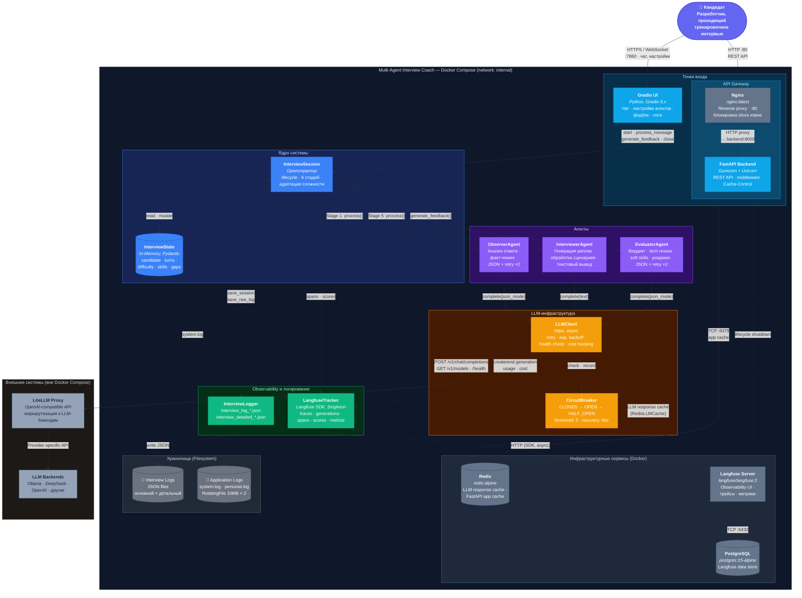

# C4 Container Diagram — Multi-Agent Interview Coach

Диаграмма уровня контейнеров: показывает runtime-компоненты системы, их технологии и взаимодействия.

---

## Диаграмма

---

## Как читать диаграмму

| Символ | Значение |
|---|---|
| `───▶` сплошная линия | Основной поток данных (критичный путь) |
| `- - ▶` пунктирная линия | Некритичный поток (observability, логирование, кэш) |
| `◀──▶` двунаправленная | Чтение и запись (InterviewSession ↔ InterviewState) |
| `(( ))` цилиндр | Хранилище данных (Redis, PostgreSQL, Filesystem) |
| Цветовые группы | 🔵 UI · 🔷 Ядро · 🟣 Агенты · 🟡 LLM · 🟢 Observability · ⚫ Инфраструктура · ⚪ Внешние |

---

## Пояснения

### Граница системы

Все компоненты внутри `SYSTEM` развёрнуты единым `docker-compose up` в общей bridge-сети `internal`. Взаимодействие Python-компонентов (Gradio UI, InterviewSession, Agents, LLMClient) — in-process вызовы внутри одного контейнера `interview-coach`. FastAPI Backend работает в отдельном контейнере `backend`.

### Инфраструктурные сервисы (внутри Docker Compose)

| Сервис | Docker-образ | Порт | Назначение |
|---|---|---|---|
| **Nginx** | `nginx:latest` | :80 (внешний) → backend:8000 | Reverse proxy для FastAPI, блокировка /docs извне |
| **Redis** | `redis:alpine` | :6379 (internal) | LLM response cache (`RedisLLMCache`) + FastAPI app cache |
| **Langfuse Server** | `langfuse/langfuse:2` | :3000 (внешний) | Observability UI, приём трейсов/генераций/span'ов |
| **PostgreSQL** | `postgres:15-alpine` | :5432 (internal) | Хранение данных Langfuse |

### Внешние системы (вне Docker Compose)

| Система | Протокол | Критичность |
|---|---|---|
| **LiteLLM Proxy** | HTTP, OpenAI-compatible | Блокирующая — без proxy невозможна генерация ответов. Circuit breaker (OPEN после 5 сбоев, recovery 60s). |
| **LLM Backends** | HTTP / Provider API | Блокирующая (транзитно через LiteLLM). Ollama, DeepSeek, OpenAI и другие. |

### Потоки данных

1. **Горячий путь (ход интервью)**: User → Gradio UI → InterviewSession → Observer → LLMClient → (Redis cache check) → LiteLLM Proxy → LLM Backend → обратно → (Redis cache write) → Interviewer → LLMClient → LiteLLM → обратно → InterviewSession → Gradio UI → User.
2. **REST API путь**: User → Nginx (:80) → FastAPI Backend → Redis (app cache).
3. **Финализация**: InterviewSession → Evaluator → LLMClient → LiteLLM → обратно → InterviewLogger → Filesystem.
4. **Observability**: LLMClient → LangfuseTracker → Langfuse Server → PostgreSQL (async flush). FastAPI lifespan управляет shutdown.
5. **LLM кэширование**: LLMClient → RedisLLMCache → Redis. При попадании в кэш — LiteLLM не вызывается (cost=0).

### Хранилища

| Хранилище | Тип | Данные | Lifecycle |
|---|---|---|---|
| InterviewState | In-memory (Pydantic) | Состояние сессии | Создаётся при start(), теряется при crash |
| Interview Logs | Filesystem (JSON) | interview_log_*.json, interview_detailed_*.json | Персистентны, без автоматической ротации |
| Application Logs | Filesystem (text) | system.log, personal.log | RotatingFileHandler, 10 MB × 2 backup |
| PostgreSQL | Docker volume | Трейсы, генерации, метрики Langfuse | Персистентны, управляется Langfuse |
| Redis | In-memory | LLM response cache (TTL-based) + FastAPI app cache | Volatile |