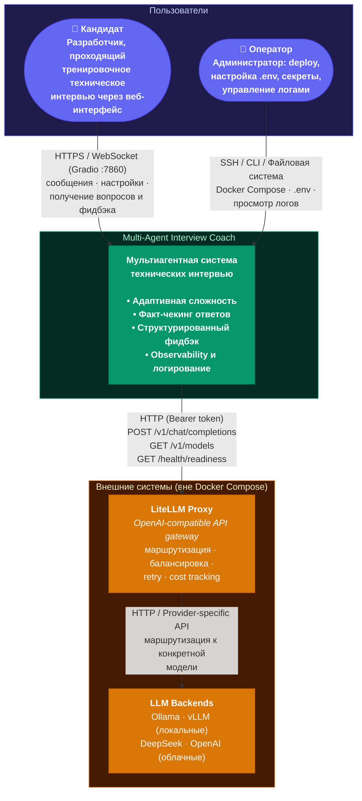

# C4 Context Diagram — Multi-Agent Interview Coach

Диаграмма уровня Context показывает систему как «чёрный ящик», пользователей и внешние зависимости.

---

## Диаграмма



---

## Как читать диаграмму

| Символ | Значение |
|---|---|
| `───▶` сплошная линия | Взаимодействие с указанием протокола |
| 🟣 фиолетовый | Пользователи (акторы) |
| 🟢 зелёный | Система (чёрный ящик на уровне Context) |
| 🟠 оранжевый | Внешние зависимости (вне Docker Compose) |

---

## Описание границ

### Пользователи

| Актор | Взаимодействие с системой |
|---|---|
| **Кандидат** | Взаимодействует через Gradio веб-интерфейс: начинает интервью, отвечает на вопросы, получает фидбэк. Не имеет прямого доступа к внутренним сервисам. |
| **Оператор** | Развёртывает систему через Docker Compose, настраивает `.env`, управляет секретами (API ключи LiteLLM, Langfuse), просматривает логи приложения и интервью, настраивает ротацию и очистку данных. |

### Внешние системы

| Система | Протокол | Критичность | Graceful degradation |
|---|---|---|---|
| **LiteLLM Proxy** | HTTP (OpenAI-compatible) | Блокирующая — без proxy невозможна генерация ответов | Circuit breaker (OPEN после 5 сбоев, recovery 60s), retry с exponential backoff, health check перед стартом сессии |
| **LLM Backend(s)** | HTTP / Provider API | Блокирующая (транзитно через LiteLLM) | Fallback между моделями на уровне LiteLLM proxy (`config.yaml`), `allowed_fails` + `cooldown_time` |

> **Примечание**: Redis, Langfuse Server и PostgreSQL (Langfuse DB) развёрнуты внутри того же Docker Compose стека и не являются внешними зависимостями. Они показаны на уровне C4 Container.

### Границы доверия

```text
┌──────────────────────────────────────────────────────────────────┐
│                    Trust Boundary: Operator Infrastructure       │
│                                                                  │
│  ┌────────────────────────────────────────────────────────────┐  │
│  │              Docker Compose Network (internal)             │  │
│  │                                                            │  │
│  │  ┌──────────────┐  ┌──────────┐  ┌──────────────────────┐ │  │
│  │  │ Gradio UI    │  │ FastAPI  │  │ Redis                │ │  │
│  │  │ (interview-  │  │ Backend  │  │ (redis_cache)        │ │  │
│  │  │  coach)      │  │          │  │                      │ │  │
│  │  └──────┬───────┘  └────┬─────┘  └──────────────────────┘ │  │
│  │         │               │                                  │  │
│  │  ┌──────┴───────────────┴──────────────────────────────┐   │  │
│  │  │              LiteLLM Proxy                          │   │  │
│  │  │  (отдельный Docker Compose или внешний сервис)      │   │  │
│  │  └─────────────────────┬───────────────────────────────┘   │  │
│  │                        │                                   │  │
│  │  ┌─────────────┐  ┌───┴────────┐                          │  │
│  │  │ Langfuse    │  │ Langfuse   │                          │  │
│  │  │ (UI/API)    │  │ DB (PG)    │                          │  │
│  │  └─────────────┘  └────────────┘                          │  │
│  └────────────────────────────────────────────────────────────┘  │
│                                                                  │
└──────────────────────────────────────────────────────────────────┘
                        │
                        ▼ (при использовании cloud-моделей)
┌──────────────────────────────────────────────────────────────────┐
│               Trust Boundary: External LLM Providers             │
│                                                                  │
│  ┌──────────────┐  ┌──────────────┐  ┌──────────────────────┐   │
│  │ DeepSeek API │  │ OpenAI API   │  │ Другие провайдеры    │   │
│  └──────────────┘  └──────────────┘  └──────────────────────┘   │
│                                                                  │
│  ⚠️ Текст сообщений кандидата передаётся провайдеру              │
│     в соответствии с его условиями обработки данных               │
└──────────────────────────────────────────────────────────────────┘
```

### Потоки данных через границы

| Поток | Данные | Направление | Конфиденциальность |
|---|---|---|---|
| Кандидат → Система | Текст сообщений, имя, позиция, опыт, технологии | Входящий | Персональные данные, обрабатываются локально при self-hosted deployment |
| Система → Кандидат | Вопросы интервью, фидбэк, метрики | Исходящий | Генерированный контент |
| Система → LiteLLM | Messages (system prompt + history + user input), параметры модели | Исходящий | Содержит текст сообщений кандидата в составе промпта |
| LiteLLM → LLM Backend | Проксированные запросы | Исходящий (транзитно) | При cloud-моделях — данные покидают периметр инфраструктуры |
| Система → Файловая система | JSON-логи интервью | Локальный | Полная история диалога, данные кандидата |