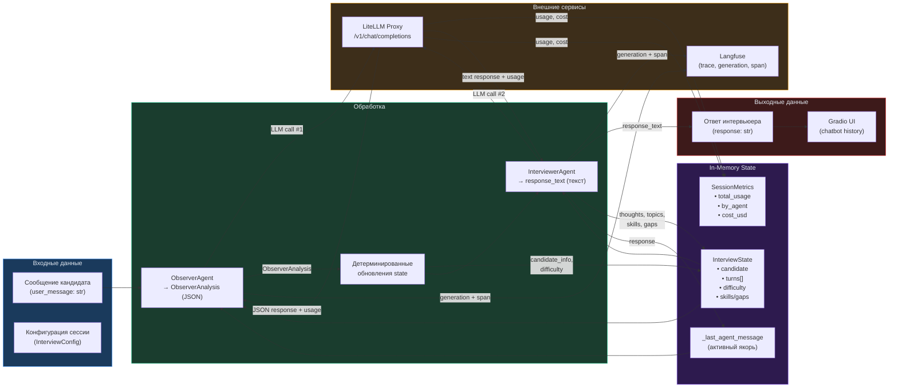
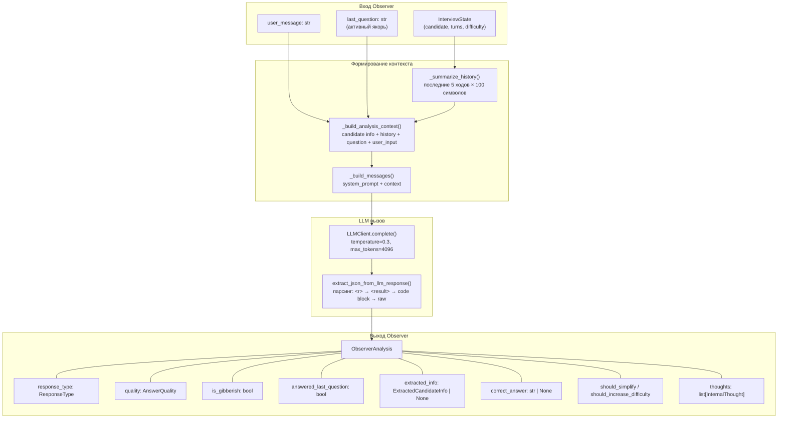
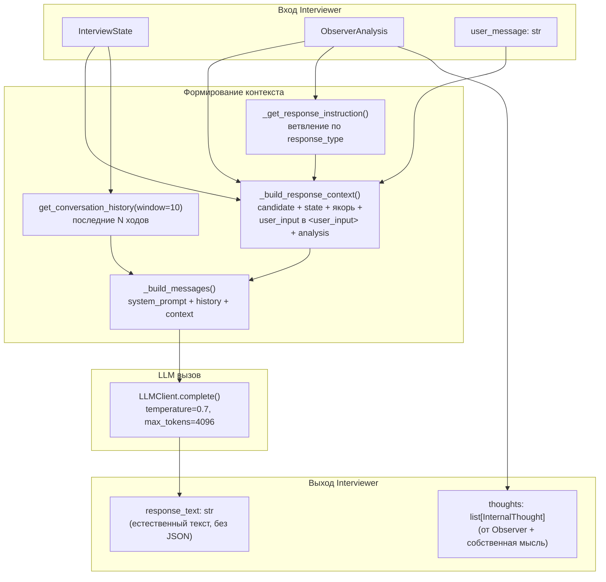
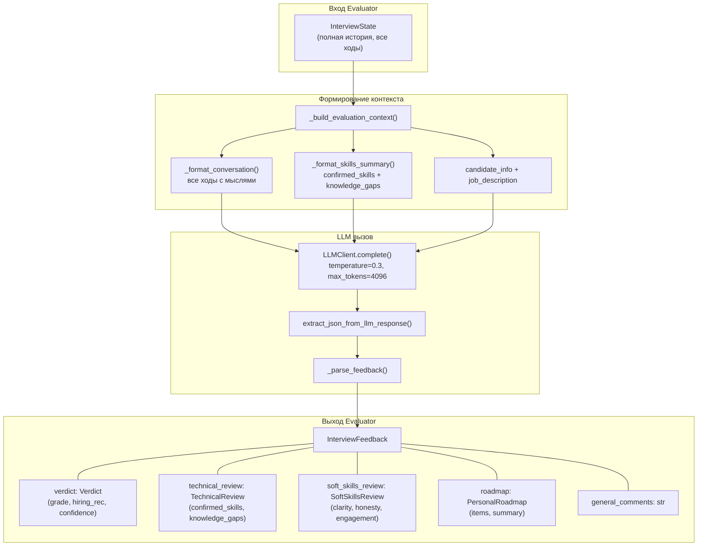
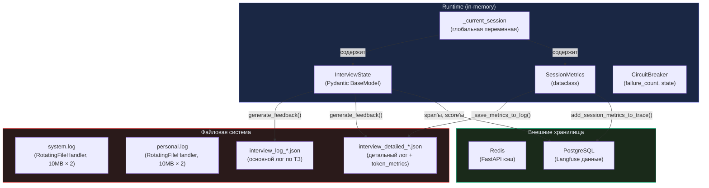
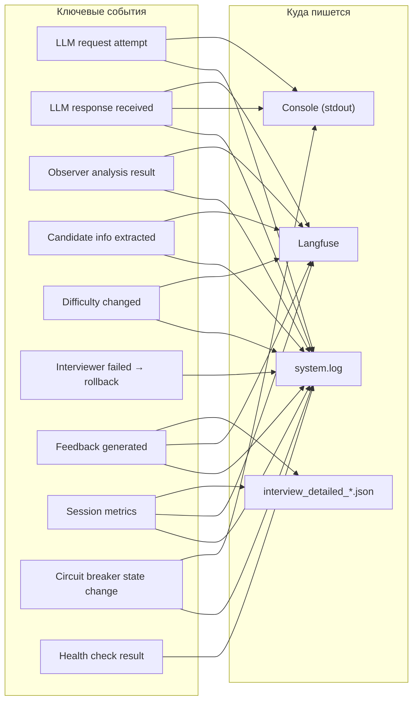

# Data Flow Diagram — Multi-Agent Interview Coach

Диаграмма описывает, как данные проходят через систему, что хранится и что логируется.

---

## 1. Общий поток данных (один ход интервью)

---

## 2. Данные Observer (вход → выход)

---

## 3. Данные Interviewer (вход → выход)

---

## 4. Данные Evaluator (вход → выход)

---

## 5. Хранилища данных

---

## 6. Что хранится в каждом хранилище

### 6.1 In-Memory (InterviewState)

| Поле | Тип | Когда обновляется | Персистируется |
|---|---|---|---|
| `candidate` | `CandidateInfo` | Stage 2 (идемпотентно) | Да, в detailed log |
| `turns[]` | `list[InterviewTurn]` | Stage 6 (новый ход) | Да, в оба лога |
| `current_difficulty` | `DifficultyLevel` | Stage 4 (с откатом) | Да, в detailed log |
| `confirmed_skills` | `list[str]` | Stage 6 (при успехе) | Да, в detailed log |
| `knowledge_gaps` | `list[dict]` | Stage 6 (при успехе) | Да, в detailed log |
| `covered_topics` | `list[str]` | Stage 6 (при успехе) | Да, в detailed log |
| `consecutive_good/bad_answers` | `int` | Stage 4 (с откатом) | Нет |

### 6.2 Файловая система

| Файл | Формат | Содержимое | Создаётся |
|---|---|---|---|
| `interview_log_*.json` | JSON (`InterviewLog`) | turns (agent_message, user_message, thoughts string), final_feedback (formatted string) | `generate_feedback()` |
| `interview_detailed_*.json` | JSON (dict) | candidate_info, interview_stats, turns (с timestamps и thoughts dict), final_feedback (model_dump), token_metrics | `generate_feedback()` |
| `system.log` | Text | Системные события: LLM запросы, ошибки, изменения сложности, извлечение данных | Непрерывно, ротация |
| `personal.log` | Text | Запросы привязанные к request_id (FastAPI backend) | Непрерывно, ротация |

### 6.3 Langfuse (PostgreSQL)

| Сущность | Содержимое | Когда записывается |
|---|---|---|
| Trace | session_id, user_id (имя кандидата), metadata (model, max_turns) | `start()` |
| Generation | input messages, output, model, usage (tokens), cost_usd, name | Каждый `LLMClient.complete()` |
| Span | greeting, user_message, observer_analysis, interviewer_response, candidate_info_update, difficulty_change, final_feedback, session_token_metrics | По ходу `process_message()` и `generate_feedback()` |
| Score | total_tokens, total_turns, llm_calls, avg_tokens_per_turn, confidence_score, session_cost_usd | `generate_feedback()` |

---

## 7. Что логируется (сводка)

