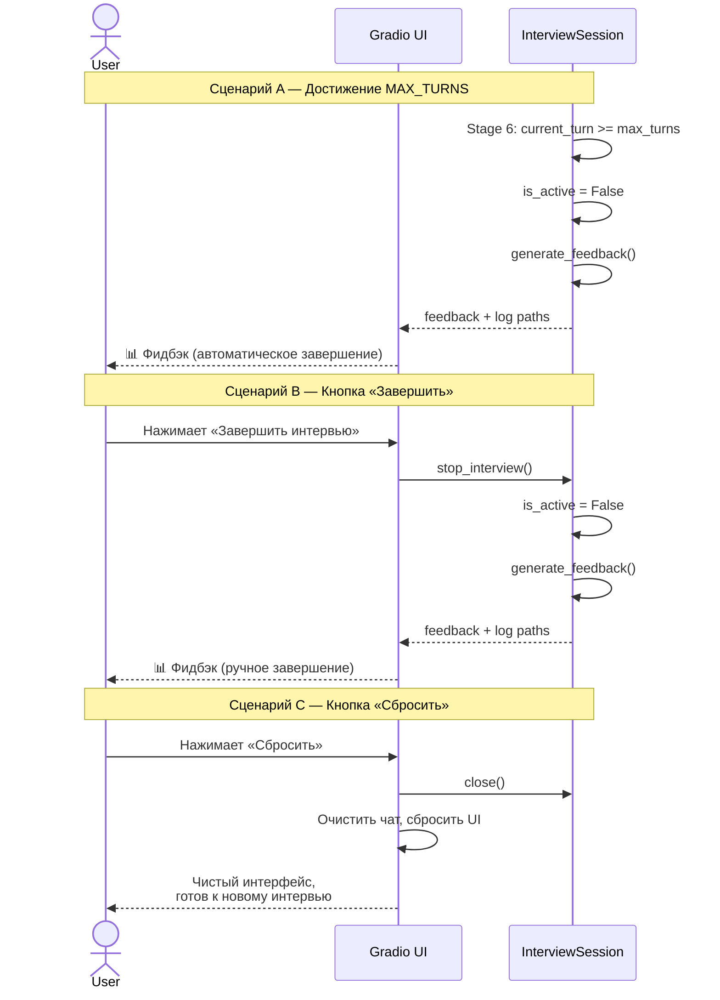
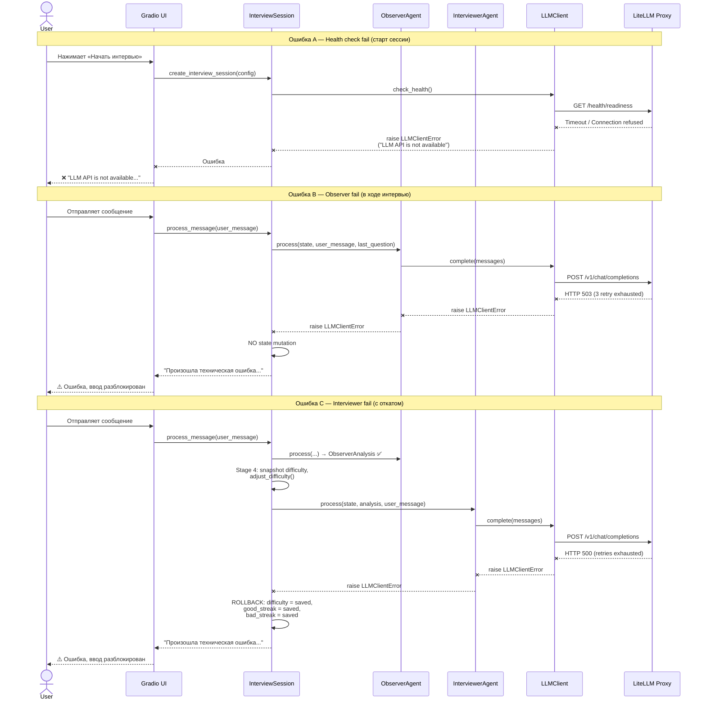

# Sequence Diagram — User Interaction (End-to-End)

Диаграмма описывает полный цикл взаимодействия пользователя с системой от запуска до получения фидбэка.

---

## 1. Полный цикл интервью

```mermaid
sequenceDiagram
    actor User
    participant GradioUI as Gradio UI<br/>(interview-coach:7860)
    participant Session as InterviewSession<br/>(Orchestrator)
    participant Observer as ObserverAgent
    participant Interviewer as InterviewerAgent
    participant Evaluator as EvaluatorAgent
    participant LLMClient as LLMClient<br/>(httpx)
    participant LiteLLM as LiteLLM Proxy<br/>(/v1/chat/completions)
    participant Langfuse as LangfuseTracker<br/>(SDK → Langfuse Server)

    Note over User, Langfuse: Фаза 1 — Запуск и конфигурация

    User ->> GradioUI: Открывает http://localhost:7860
    GradioUI ->> GradioUI: get_models_for_ui()<br/>→ fetch_available_models_sync()
    GradioUI ->> LiteLLM: GET /v1/models (httpx)
    LiteLLM -->> GradioUI: {"data": [{"id": "local_llm"}, ...]}
    GradioUI ->> GradioUI: Сортировка и фильтрация моделей
    GradioUI -->> User: UI с dropdown моделей,<br/>слайдерами температуры, max_turns

    User ->> GradioUI: Выбирает модель, temperature,<br/>max_turns, вводит job description

    Note over User, Langfuse: Фаза 2 — Старт сессии

    User ->> GradioUI: Нажимает «Начать интервью»
    GradioUI ->> GradioUI: start_interview()
    GradioUI ->> GradioUI: Закрыть предыдущую сессию (если есть)
    GradioUI ->> Session: create_interview_session(config)

    Session ->> LLMClient: check_health()<br/>GET /health/readiness
    LLMClient ->> LiteLLM: GET /health/readiness
    LiteLLM -->> LLMClient: HTTP 200 OK
    LLMClient -->> Session: ✅ Healthy

    Session ->> Session: InterviewState(job_description=...)<br/>session_id = uuid4()
    Session ->> Langfuse: create_trace(name="interview_session",<br/>session_id, metadata)

    Session ->> Interviewer: generate_greeting(state)
    Interviewer ->> LLMClient: complete(messages,<br/>generation_name="interviewer_greeting",<br/>max_tokens=300)
    LLMClient ->> Langfuse: create_generation(name="interviewer_greeting")
    LLMClient ->> LiteLLM: POST /v1/chat/completions<br/>{model, messages, temperature=0.7}
    LiteLLM -->> LLMClient: {content: "Здравствуйте! Я ваш...",<br/>usage: {prompt: 850, completion: 120}}
    LLMClient ->> Langfuse: end_generation(usage, cost)
    LLMClient -->> Interviewer: "Здравствуйте! Я ваш интервьюер..."
    Interviewer -->> Session: greeting_text

    Session ->> Session: InterviewTurn(agent_message=greeting)
    Session ->> Langfuse: add_span(name="greeting",<br/>output=greeting_text)

    Session -->> GradioUI: greeting_text
    GradioUI -->> User: 💬 "Здравствуйте! Я ваш интервьюер..."

    Note over User, Langfuse: Фаза 3 — Диалог (один ход)

    User ->> GradioUI: Вводит сообщение:<br/>"Привет! Меня зовут Алексей,<br/>я Python-разработчик с 3 годами опыта"
    GradioUI ->> GradioUI: add_user_message()<br/>— добавить в чат, заблокировать ввод
    GradioUI ->> Session: process_message(user_message)
    Session ->> Langfuse: add_span(name="user_message",<br/>input=user_message)

    rect rgb(30, 60, 40)
        Note over Session, LiteLLM: Stage 1 — Observer (LLM Call #1)
        Session ->> Observer: process(state, user_message, last_question)
        Observer ->> Observer: _build_analysis_context()<br/>_build_messages()
        Observer ->> LLMClient: complete(messages,<br/>generation_name="observer_analysis",<br/>temperature=0.3, json_mode=True)
        LLMClient ->> Langfuse: create_generation(name="observer_analysis")
        LLMClient ->> LiteLLM: POST /v1/chat/completions<br/>{model, messages, temperature=0.3,<br/>response_format: json_schema}
        LiteLLM -->> LLMClient: {content: '{"response_type":"INTRODUCTION",...}',<br/>usage: {prompt: 1200, completion: 350}}
        LLMClient ->> Langfuse: end_generation(usage, cost)
        LLMClient -->> Observer: JSON response
        Observer ->> Observer: extract_json_from_llm_response()<br/>_parse_analysis()<br/>_resolve_answered_last_question()
        Observer -->> Session: ObserverAnalysis:<br/>response_type=INTRODUCTION,<br/>extracted_info={name:"Алексей", experience:"3 года"}
        Session ->> Langfuse: add_span(name="observer_analysis",<br/>output=analysis)
    end

    rect rgb(45, 30, 50)
        Note over Session: Stage 2 — Идемпотентное обновление CandidateInfo
        Session ->> Session: _update_candidate_info(extracted_info)<br/>candidate.name = "Алексей" (было None)
        Session ->> Langfuse: add_span(name="candidate_info_update")
    end

    rect rgb(30, 40, 60)
        Note over Session: Stage 3 — Проверка стоп-команды
        Session ->> Session: response_type != STOP_COMMAND → продолжаем
    end

    rect rgb(50, 40, 20)
        Note over Session: Stage 4 — Корректировка сложности (snapshot)
        Session ->> Session: saved_difficulty = BASIC<br/>saved_good_streak = 0<br/>saved_bad_streak = 0<br/>→ INTRODUCTION, пропуск adjust_difficulty
    end

    rect rgb(30, 60, 40)
        Note over Session, LiteLLM: Stage 5 — Interviewer (LLM Call #2)
        Session ->> Interviewer: process(state, analysis, user_message)
        Interviewer ->> Interviewer: _get_response_instruction()<br/>→ INTRODUCTION: "Поблагодарить + первый вопрос"
        Interviewer ->> Interviewer: _build_response_context()<br/>get_conversation_history(window=10)<br/>_build_messages()
        Interviewer ->> LLMClient: complete(messages,<br/>generation_name="interviewer_response",<br/>temperature=0.7)
        LLMClient ->> Langfuse: create_generation(name="interviewer_response")
        LLMClient ->> LiteLLM: POST /v1/chat/completions<br/>{model, messages, temperature=0.7}
        LiteLLM -->> LLMClient: {content: "Приятно познакомиться, Алексей!<br/>Расскажите про декораторы в Python...",<br/>usage: {prompt: 1500, completion: 200}}
        LLMClient ->> Langfuse: end_generation(usage, cost)
        LLMClient -->> Interviewer: response_text
        Interviewer -->> Session: (response_text, thoughts)
    end

    rect rgb(45, 30, 50)
        Note over Session: Stage 6 — Фиксация
        Session ->> Session: increment_turn()<br/>_update_state_from_analysis()<br/>_last_agent_message = response<br/>Новый InterviewTurn(agent_message=response)
        Session ->> Langfuse: add_span(name="interviewer_response")
    end

    Session ->> Session: current_turn < max_turns → продолжаем
    Session -->> GradioUI: response_text
    GradioUI -->> User: 💬 "Приятно познакомиться, Алексей!<br/>Расскажите про декораторы..."
    GradioUI ->> GradioUI: Разблокировать ввод

    Note over User, Langfuse: Фаза 3 повторяется N раз (8–20 ходов)

    User ->> GradioUI: Отвечает на вопрос...
    GradioUI ->> Session: process_message(...)
    Note right of Session: Observer → LLM Call #1<br/>Interviewer → LLM Call #2<br/>(цикл повторяется)
    Session -->> GradioUI: response
    GradioUI -->> User: 💬 Следующий вопрос...

    Note over User, Langfuse: Фаза 4 — Завершение (стоп-команда)

    User ->> GradioUI: Вводит "стоп"
    GradioUI ->> GradioUI: add_user_message()
    GradioUI ->> Session: process_message("стоп")
    Session ->> Langfuse: add_span(name="user_message", input="стоп")

    Session ->> Observer: process(state, "стоп", last_question)
    Observer ->> LLMClient: complete(messages, "observer_analysis")
    LLMClient ->> LiteLLM: POST /v1/chat/completions
    LiteLLM -->> LLMClient: {response_type: "STOP_COMMAND"}
    LLMClient -->> Observer: JSON response
    Observer -->> Session: ObserverAnalysis:<br/>response_type=STOP_COMMAND

    Session ->> Session: is_active = False

    Note over User, Langfuse: Фаза 5 — Генерация фидбэка

    Session ->> Evaluator: process(state)
    Evaluator ->> Evaluator: _build_evaluation_context()<br/>_format_conversation()<br/>_format_skills_summary()
    Evaluator ->> LLMClient: complete(messages,<br/>generation_name="evaluator_feedback",<br/>temperature=0.3, json_mode=True)
    LLMClient ->> Langfuse: create_generation(name="evaluator_feedback")
    LLMClient ->> LiteLLM: POST /v1/chat/completions<br/>{model, messages, temperature=0.3,<br/>response_format: json_schema}
    LiteLLM -->> LLMClient: {content: '{"verdict":{"grade":"Middle",...},...}',<br/>usage: {prompt: 4500, completion: 1200}}
    LLMClient ->> Langfuse: end_generation(usage, cost)
    LLMClient -->> Evaluator: JSON response
    Evaluator ->> Evaluator: extract_json_from_llm_response()<br/>_parse_feedback()
    Evaluator -->> Session: InterviewFeedback:<br/>verdict, technical_review,<br/>soft_skills_review, roadmap

    Note over User, Langfuse: Фаза 6 — Финализация и сохранение

    Session ->> Langfuse: add_span(name="final_feedback",<br/>output=feedback)
    Session ->> Langfuse: score_trace(confidence_score)
    Session ->> Langfuse: add_session_metrics_to_trace()<br/>(total_tokens, total_turns, llm_calls,<br/>avg_tokens_per_turn, session_cost_usd)
    Session ->> Langfuse: flush()

    Session ->> Session: InterviewLogger.save_session()<br/>→ interview_log_*.json
    Session ->> Session: InterviewLogger.save_raw_log()<br/>→ interview_detailed_*.json
    Session ->> Session: _save_metrics_to_log()<br/>→ token_metrics в детальный лог

    Session -->> GradioUI: (feedback, summary_path,<br/>detailed_path)
    GradioUI -->> User: 📊 Фидбэк: вердикт, технический обзор,<br/>soft skills, роадмап развития
    GradioUI -->> User: 📁 Ссылки на файлы логов
    GradioUI ->> GradioUI: Разблокировать ввод,<br/>показать кнопку «Сбросить»
```

---

## 2. Описание этапов

| Фаза | Название | Участники | Ключевые действия | LLM-вызовы |
|---|---|---|---|---|
| 1 | **Запуск и конфигурация** | User, Gradio UI, LLMClient, LiteLLM | Загрузка UI, получение списка моделей (`GET /v1/models`), настройка параметров (model, temperature, max_turns, job_description) | 0 |
| 2 | **Старт сессии** | User, Gradio UI, Session, Interviewer, LLMClient, LiteLLM, Langfuse | Health check (`GET /health/readiness`), создание `InterviewState` и `session_id`, создание Langfuse trace, генерация приветствия | 1 (greeting) |
| 3 | **Диалог (один ход)** | User, Gradio UI, Session, Observer, Interviewer, LLMClient, LiteLLM, Langfuse | 6 стадий обработки: Observer → обновление CandidateInfo → проверка стоп-команды → адаптация сложности → Interviewer → фиксация | 2 (Observer + Interviewer) |
| 4 | **Завершение** | User, Gradio UI, Session, Observer, LLMClient, LiteLLM | Пользователь отправляет «стоп», Observer распознаёт `STOP_COMMAND`, `is_active = False` | 1 (Observer) |
| 5 | **Генерация фидбэка** | Session, Evaluator, LLMClient, LiteLLM, Langfuse | Evaluator формирует контекст из полной истории, генерирует `InterviewFeedback` (verdict, technical_review, soft_skills_review, roadmap) | 1 (Evaluator) |
| 6 | **Финализация** | Session, Langfuse, Filesystem | Запись span'ов и score'ов в Langfuse, flush, сохранение `interview_log_*.json` и `interview_detailed_*.json` | 0 |

---

## 3. Альтернативные сценарии завершения

---

## 4. Обработка ошибок

---

## 5. Счётчик LLM-вызовов за сессию

| Этап | LLM-вызовы | Примечание |
|---|---|---|
| Приветствие | 1 | `interviewer_greeting` |
| Каждый ход (×N) | 2 × N | Observer (`observer_analysis`) + Interviewer (`interviewer_response`) |
| Стоп-команда | 1 | Observer распознаёт `STOP_COMMAND` |
| Фидбэк | 1 | Evaluator (`evaluator_feedback`) |
| **Итого** | 2N + 3 | При N=8: 19, при N=20: 43 |

> **Пример**: интервью из 10 ходов = 1 (greeting) + 20 (10 × 2) + 1 (stop observer) + 1 (evaluator) = **23 LLM-вызова**.