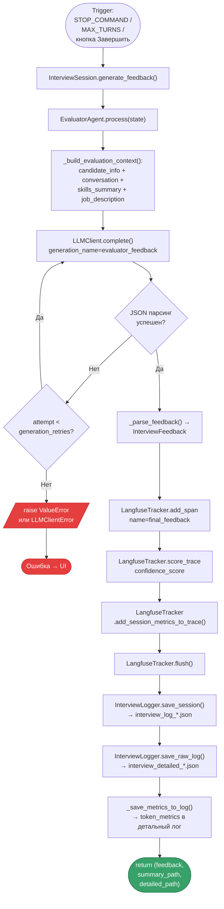
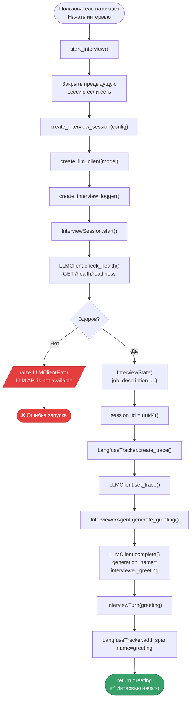
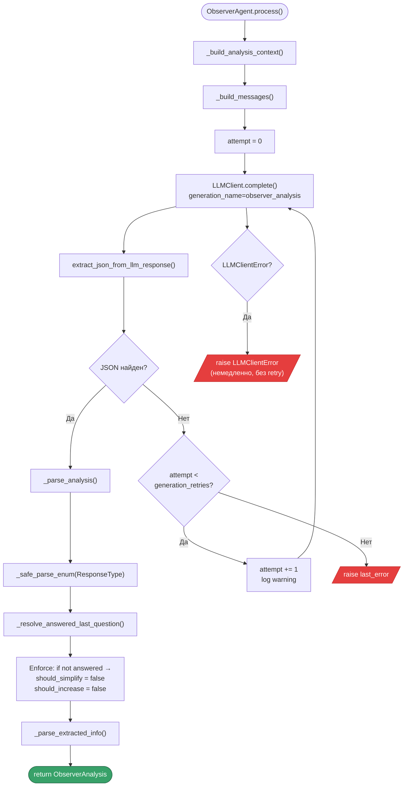
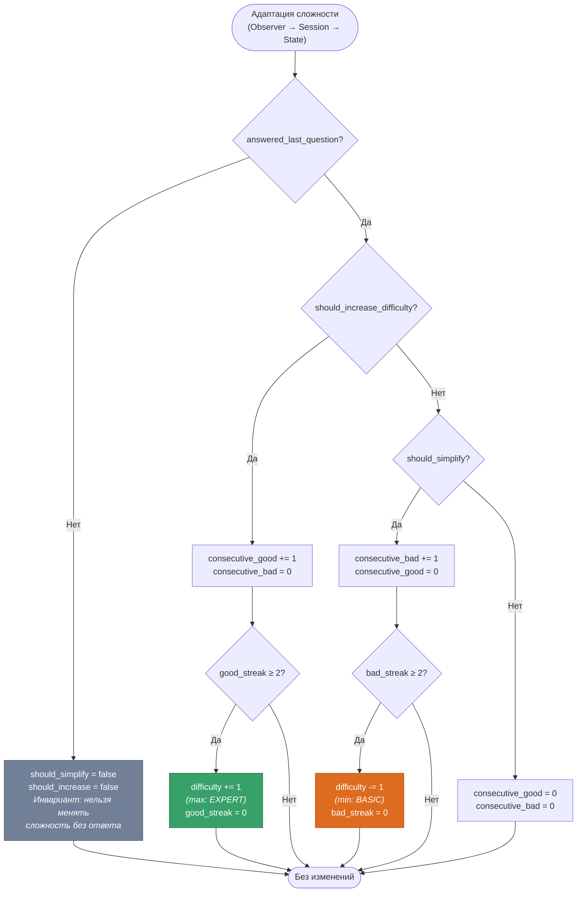
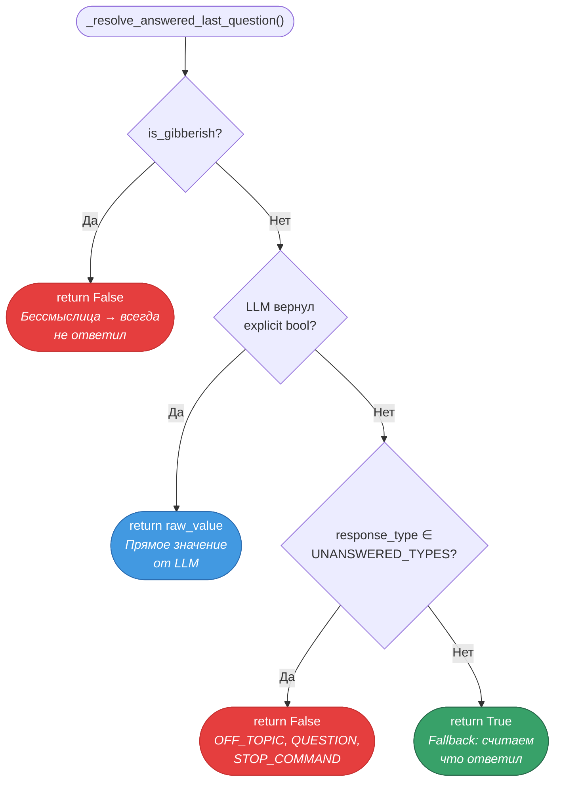
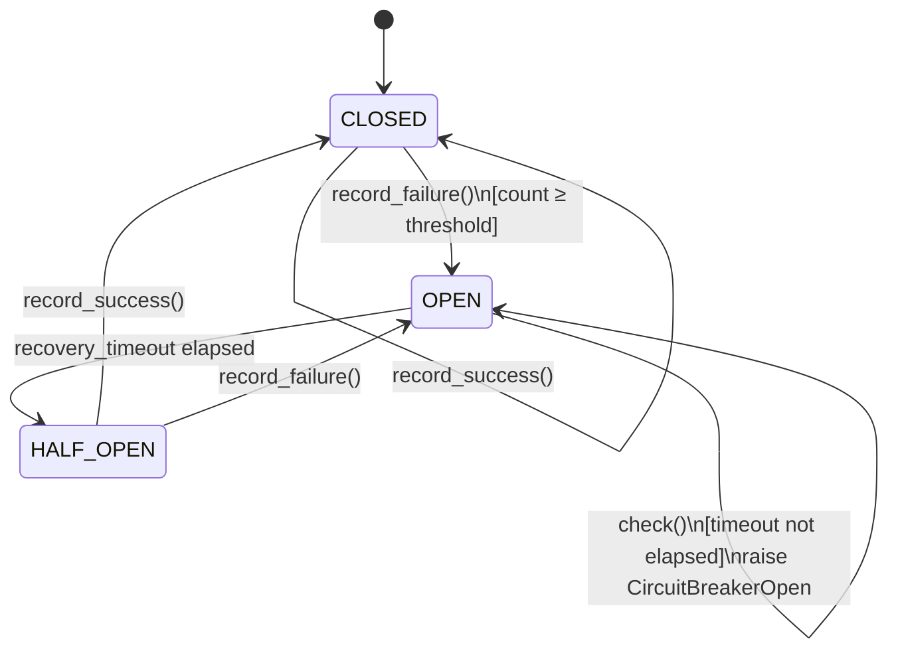

# Workflow Diagrams — Multi-Agent Interview Coach

Диаграммы описывают пошаговое выполнение запроса, включая ветки ошибок и финализацию.

---

## 1. Workflow обработки одного хода (Message Processing)

```mermaid
flowchart TD
    A([Пользователь отправляет сообщение]) --> B["add_user_message()<br/><i>sync, queue=False</i>"]
    B --> B1[Добавить сообщение в чат UI]
    B1 --> B2[Заблокировать ввод]
    B2 --> C["bot_respond()<br/><i>async generator</i>"]

    C --> D["InterviewSession.process_message()"]

    D --> E["Записать user_message<br/>в последний InterviewTurn"]
    E --> F["LangfuseTracker.add_span<br/>name=user_message"]

    F --> G{{"Stage 1: Observer"}}
    G --> G1["ObserverAgent.process()<br/>→ LLMClient.complete()<br/>→ LLM Call #1"]
    G1 --> G2{Успех?}
    G2 -->|Нет| G3["return error message<br/><b>NO state mutation</b>"]
    G3 --> Z1([Разблокировать ввод])

    G2 -->|Да| H["ObserverAnalysis:<br/>response_type, quality,<br/>answered_last_question,<br/>is_gibberish, extracted_info"]
    H --> H1["LangfuseTracker.add_span<br/>name=observer_analysis"]

    H1 --> I{{"Stage 2: Идемпотентное<br/>обновление CandidateInfo"}}
    I --> I1{extracted_info<br/>не пуст?}
    I1 -->|Да| I2["_update_candidate_info()<br/><i>поле обновляется только<br/>если текущее = None</i>"]
    I1 -->|Нет| J
    I2 --> J

    J --> K{{"Stage 3: Стоп-команда?"}}
    K --> K1{response_type ==<br/>STOP_COMMAND?}
    K1 -->|Да| K2["is_active = False"]
    K2 --> K3(["→ generate_feedback()"])

    K1 -->|Нет| L{{"Stage 4: Корректировка<br/>сложности"}}
    L --> L0["Snapshot:<br/>saved_difficulty<br/>saved_good_streak<br/>saved_bad_streak"]
    L0 --> L1{answered_last_question?}
    L1 -->|Да| L2["state.adjust_difficulty(analysis)<br/><i>streak ≥ 2 → difficulty ±1</i>"]
    L1 -->|Нет| L3["Skip<br/><i>нельзя менять сложность<br/>без ответа на вопрос</i>"]
    L2 --> M
    L3 --> M

    M --> N{{"Stage 5: Interviewer"}}
    N --> N1["InterviewerAgent.process()<br/>→ LLMClient.complete()<br/>→ LLM Call #2"]
    N1 --> N2{Успех?}
    N2 -->|Нет| N3["ROLLBACK:<br/>difficulty = saved<br/>good_streak = saved<br/>bad_streak = saved"]
    N3 --> N4["return error message<br/><b>NO non-idempotent mutations</b>"]
    N4 --> Z1

    N2 -->|Да| O{{"Stage 6: Фиксация"}}
    O --> O1["increment_turn()"]
    O1 --> O2["_update_state_from_analysis()<br/>→ covered_topics<br/>→ confirmed_skills<br/>→ knowledge_gaps"]
    O2 --> O3["_last_agent_message = response"]
    O3 --> O4["Записать thoughts<br/>в последний turn"]
    O4 --> O5["Создать новый InterviewTurn<br/>с ответом Interviewer"]
    O5 --> O6["LangfuseTracker.add_span<br/>name=interviewer_response"]

    O6 --> P{current_turn ≥<br/>MAX_TURNS?}
    P -->|Да| P1["is_active = False"]
    P1 --> P2(["→ generate_feedback()"])
    P -->|Нет| Q(["yield response<br/>Разблокировать ввод"])

    style G fill:#4a5568,stroke:#a0aec0,color:#fff
    style I fill:#4a5568,stroke:#a0aec0,color:#fff
    style K fill:#4a5568,stroke:#a0aec0,color:#fff
    style L fill:#4a5568,stroke:#a0aec0,color:#fff
    style N fill:#4a5568,stroke:#a0aec0,color:#fff
    style O fill:#4a5568,stroke:#a0aec0,color:#fff
    style G3 fill:#e53e3e,stroke:#c53030,color:#fff
    style N3 fill:#e53e3e,stroke:#c53030,color:#fff
    style N4 fill:#e53e3e,stroke:#c53030,color:#fff
    style K2 fill:#38a169,stroke:#276749,color:#fff
    style P1 fill:#38a169,stroke:#276749,color:#fff
```



---

## 2. Workflow генерации фидбэка (Feedback Generation)



---

## 3. Workflow старта сессии (Session Start)



---

## 4. Workflow Observer — retry и парсинг



---

## 5. Workflow LLMClient.complete() — retry и circuit breaker

```mermaid
flowchart TD
    A(["LLMClient.complete()"]) --> A1["compute_cache_key()<br/>SHA-256(model, messages,<br/>temperature, max_tokens, json_mode)"]
    A1 --> A2{"Cache hit?"}
    A2 -->|"Да"| A3(["return cached response<br/>(cost=0, Langfuse: cached=true)"])
    A2 -->|"Нет"| B["circuit_breaker.check()"]
    B --> B1{OPEN?}
    B1 -->|Да| B2[/"raise CircuitBreakerOpen"/]
    B1 -->|Нет| C["attempt = 0"]

    C --> D["POST /v1/chat/completions"]
    D --> D1{HTTP Status?}

    D1 -->|2xx| E["Parse JSON response"]
    E --> E1["Extract content, usage, cost"]
    E1 --> E2["LangfuseTracker.end_generation()"]
    E2 --> E3["circuit_breaker.record_success()"]
    E3 --> E4["cache.set(key, content, TTL)"]
    E4 --> F(["return content"])

    D1 -->|429, 500-504| G{"attempt &lt;<br/>max_retries?"}
    G -->|Да| G1["delay = base × 2^attempt<br/>(capped at max)"]
    G1 --> G2["await sleep(delay)"]
    G2 --> G3["attempt += 1"]
    G3 --> D
    G -->|Нет| G4["circuit_breaker.record_failure()<br/><i>(только 500–504, timeout,<br/>request error; НЕ 429)</i>"]
    G4 --> G5[/"raise LLMClientError<br/>Max retries exceeded"/]

    D1 -->|4xx (не 429)| H["end_generation_with_error()"]
    H --> H1[/"raise LLMClientError<br/>HTTP error"/]

    D --> T{Timeout?}
    T -->|Да| T1{"attempt &lt;<br/>max_retries?"}
    T1 -->|Да| G1
    T1 -->|Нет| G4

    D --> R{RequestError?}
    R -->|Да| R1{"attempt &lt;<br/>max_retries?"}
    R1 -->|Да| G1
    R1 -->|Нет| G4

    style B2 fill:#e53e3e,stroke:#c53030,color:#fff
    style G5 fill:#e53e3e,stroke:#c53030,color:#fff
    style H1 fill:#e53e3e,stroke:#c53030,color:#fff
    style A3 fill:#38a169,stroke:#276749,color:#fff
    style F fill:#38a169,stroke:#276749,color:#fff
```

---

## 6. Workflow адаптации сложности (комбинированный поток)



---

## 7. Workflow определения answered_last_question



---

## 8. Workflow Circuit Breaker — переходы состояний


