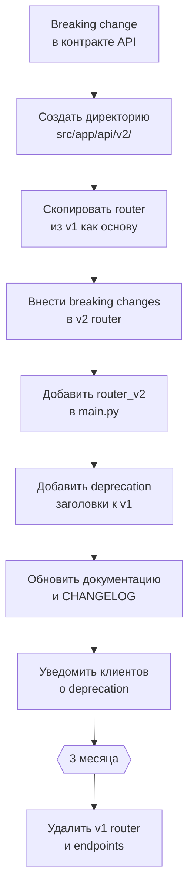

# Spec: API Versioning Strategy

Стратегия версионирования API для Multi-Agent Interview Coach.

---

## 1. Текущее состояние

### 1.1 Архитектура API

Система предоставляет два независимых интерфейса:

| Интерфейс | Технология | Назначение | Версионирование |
|---|---|---|---|
| **Gradio UI** | Gradio 5.x (WebSocket + HTTP) | Основной пользовательский интерфейс, чат с интервьюером | Нет (in-process вызовы) |
| **FastAPI Backend** | FastAPI + Gunicorn/Uvicorn | REST API для вспомогательных endpoints, документация | Единственная версия `/v1/` |

### 1.2 Текущие endpoints (FastAPI)

FastAPI backend предоставляет вспомогательные endpoints, проксируемые через Nginx:

| Метод | Путь | Назначение |
|---|---|---|
| `GET` | `/docs` | Swagger UI |
| `GET` | `/redoc` | ReDoc |
| `GET` | `/openapi.json` | OpenAPI schema |

> **Примечание**: Gradio UI обращается к LLM напрямую через `LLMClient` (httpx → LiteLLM Proxy), минуя FastAPI backend. FastAPI backend и Gradio UI — это два независимых контейнера (`backend` и `interview-coach`), работающих в одной Docker Compose сети.

### 1.3 Внутренние контракты

Агенты взаимодействуют через Pydantic-модели (in-process вызовы, не сетевые):

| Контракт | Модуль | Используется |
|---|---|---|
| `InterviewState` | `src/app/schemas/` | Оркестратор, все агенты |
| `ObserverAnalysis` | `src/app/schemas/` | Observer → Orchestrator → Interviewer |
| `InterviewFeedback` | `src/app/schemas/` | Evaluator → Orchestrator → UI |
| `InterviewConfig` | `src/app/schemas/` | UI → Orchestrator |
| `CandidateInfo` | `src/app/schemas/` | Observer → Orchestrator (идемпотентное обновление) |
| `SessionMetrics` | `src/app/observability/` | LLMClient → Orchestrator → Langfuse |

---

## 2. Стратегия версионирования

### 2.1 URL-based versioning

Версионирование REST API выполняется через URL-prefix:

| Версия | Prefix | Статус | Описание |
|---|---|---|---|
| v1 | `/api/v1/` | Текущая (active) | Начальная версия API |
| v2 | `/api/v2/` | Будущая (planned) | Создаётся при первом breaking change |

### 2.2 Правила версионирования

#### Что требует новой мажорной версии (breaking change)

- Удаление или переименование endpoint.
- Изменение типа или формата обязательного поля в request/response.
- Удаление поля из response (клиенты могут зависеть от него).
- Изменение семантики существующего поля (например, `score: int` в процентах → `score: float` в долях).
- Изменение HTTP-метода endpoint'а.
- Изменение кодов ошибок для существующих сценариев.

#### Что НЕ требует новой версии (обратно совместимые изменения)

- Добавление нового опционального поля в request.
- Добавление нового поля в response.
- Добавление нового endpoint.
- Добавление нового значения в enum (если клиент обрабатывает unknown gracefully).
- Изменение описания или документации.
- Добавление нового HTTP-заголовка в ответ.

#### Политика поддержки deprecated-версий

| Правило | Значение |
|---|---|
| Минимальный период поддержки deprecated-версии | 3 месяца после выхода новой |
| Заголовок deprecation | `Deprecation: true` + `Sunset: <date>` в ответах deprecated-версии |
| Логирование | Каждый запрос к deprecated-версии логируется с уровнем `WARNING` |
| Документация | Swagger UI deprecated-версии помечается баннером |

#### Заголовок версии

Все ответы API содержат заголовок с фактической версией:

```
X-API-Version: v1
```

Этот заголовок информационный — маршрутизация выполняется исключительно по URL-prefix, не по заголовку.

### 2.3 Реализация в FastAPI

Версионирование реализуется через `APIRouter` с prefix'ом:

```python
# src/app/api/v1/router.py
from fastapi import APIRouter

router_v1 = APIRouter(prefix="/api/v1", tags=["v1"])


@router_v1.get("/health")
async def health_check():
    return {"status": "ok", "version": "v1"}


@router_v1.get("/models")
async def list_models():
    """Список доступных LLM-моделей."""
    ...
```

```python
# src/app/api/v2/router.py  (будущее)
from fastapi import APIRouter

router_v2 = APIRouter(prefix="/api/v2", tags=["v2"])


@router_v2.get("/health")
async def health_check():
    return {"status": "ok", "version": "v2"}
```

```python
# src/app/main.py
from fastapi import FastAPI
from .api.v1.router import router_v1
# from .api.v2.router import router_v2  # будущее

app = FastAPI()
app.include_router(router_v1)
# app.include_router(router_v2)
```

### 2.4 Middleware для заголовка версии

```python
# src/app/middleware/api_version_middleware.py
from starlette.middleware.base import BaseHTTPMiddleware
from starlette.requests import Request
from starlette.responses import Response


class APIVersionMiddleware(BaseHTTPMiddleware):
    """Добавляет заголовок X-API-Version к ответам API."""

    async def dispatch(self, request: Request, call_next) -> Response:
        response = await call_next(request)

        path = request.url.path
        if path.startswith("/api/v1"):
            response.headers["X-API-Version"] = "v1"
        elif path.startswith("/api/v2"):
            response.headers["X-API-Version"] = "v2"

        return response
```

### 2.5 OpenAPI schema per version

Каждая версия API генерирует собственную OpenAPI schema:

| Версия | Swagger UI | OpenAPI JSON |
|---|---|---|
| v1 | `/api/v1/docs` | `/api/v1/openapi.json` |
| v2 | `/api/v2/docs` | `/api/v2/openapi.json` |

---

## 3. Версионирование внутренних контрактов

### 3.1 Подход

Внутренние Pydantic-модели (`InterviewState`, `ObserverAnalysis`, `InterviewFeedback` и т.д.) не требуют URL-based версионирования, так как используются in-process. Вместо этого применяется **эволюционное версионирование** с обратной совместимостью.

### 3.2 Правила для Pydantic-моделей

| Правило | Реализация |
|---|---|
| Новые поля — всегда `Optional` с default | `new_field: str \| None = None` |
| Удаление полей — через deprecation | Поле сохраняется с `deprecated=True` в `Field()`, удаляется через 2 релиза |
| Переименование полей | Alias: `Field(alias="old_name")` + `model_config = ConfigDict(populate_by_name=True)` |
| Изменение типа поля | Новое поле с новым именем + adapter, старое поле deprecated |
| Enum расширение | Новые значения добавляются свободно; парсинг использует `_safe_parse_enum()` с fallback |

### 3.3 Пример эволюции модели

```python
# Было (v1):
class ObserverAnalysis(BaseModel):
    response_type: ResponseType
    quality: AnswerQuality
    is_gibberish: bool


# Стало (v1, обратно совместимое расширение):
class ObserverAnalysis(BaseModel):
    response_type: ResponseType
    quality: AnswerQuality
    is_gibberish: bool
    # Новые поля — Optional с default
    confidence: float | None = None
    detected_language: str | None = None
```

### 3.4 Версионирование JSON-логов

Файлы `interview_log_*.json` и `interview_detailed_*.json` содержат сериализованные Pydantic-модели. Для обеспечения совместимости при чтении старых логов:

| Стратегия | Описание |
|---|---|
| Schema version field | Добавить `"schema_version": "1.0"` в корень JSON-лога |
| Forward compatibility | Парсер игнорирует неизвестные поля (`extra="ignore"`) |
| Backward compatibility | Новые поля имеют default values; отсутствие поля в старом логе не вызывает ошибку |
| Migration script | При необходимости — скрипт `scripts/migrate_logs.py` для обновления формата старых логов |

---

## 4. Миграция между версиями

### 4.1 Процесс создания новой версии API



### 4.2 Структура директорий

```
src/app/api/
├── __init__.py
├── v1/
│   ├── __init__.py
│   ├── router.py          # APIRouter(prefix="/api/v1")
│   ├── endpoints/
│   │   ├── health.py
│   │   ├── models.py
│   │   └── interview.py
│   └── schemas/
│       ├── requests.py    # Request-модели (могут отличаться от internal)
│       └── responses.py   # Response-модели (стабильный контракт)
├── v2/                    # (будущее)
│   ├── __init__.py
│   ├── router.py
│   ├── endpoints/
│   └── schemas/
└── deps.py                # Общие зависимости (auth, rate limiting)
```

### 4.3 Стратегия миграции клиентов

| Этап | Действие | Длительность |
|---|---|---|
| 1. Анонс | Публикация changelog с описанием breaking changes и маршрутом миграции | Момент выпуска v2 |
| 2. Параллельная работа | v1 и v2 работают одновременно; v1 помечена `Deprecation: true` | 3 месяца |
| 3. Мониторинг | Логирование запросов к v1; отслеживание количества клиентов на старой версии | Непрерывно |
| 4. Уведомление | За 2 недели до sunset — повторное уведомление клиентов | За 2 недели |
| 5. Sunset | Удаление v1; запросы к `/api/v1/*` возвращают `410 Gone` | Момент sunset |

### 4.4 Ответ при обращении к удалённой версии

```json
{
  "detail": "API version v1 has been sunset. Please migrate to /api/v2/. Documentation: /api/v2/docs",
  "migration_guide": "https://docs.example.com/migration/v1-to-v2"
}
```

HTTP-код: `410 Gone`.

---

## 5. Версионирование Gradio UI

### 5.1 Подход

Gradio UI не предоставляет программный API и не требует формального версионирования. Изменения в UI обратно совместимы для пользователя (нет машинных клиентов).

### 5.2 Неявные контракты

| Контракт | Где определён | Версионирование |
|---|---|---|
| Параметры `InterviewConfig` | `GradioUISettings` + UI sliders | Обратно совместимое расширение |
| Формат chatbot history | Gradio `Chatbot` component | Управляется Gradio SDK |
| Формат файлов логов для скачивания | `InterviewLogger` | Schema version в JSON |

---

## 6. Версионирование LLM-контрактов

### 6.1 Промпты агентов

Промпты Observer, Interviewer и Evaluator — это неявные контракты с LLM. Изменение промпта может изменить структуру ответа.

| Агент | Формат ответа | Стратегия |
|---|---|---|
| Observer | Структурированный JSON (`ObserverAnalysis`) | `extract_json_from_llm_response()` с fallback-парсингом (`<r>` → `<result>` → code block → raw) |
| Interviewer | Свободный текст | Нет контракта — любой текст валиден |
| Evaluator | Структурированный JSON (`InterviewFeedback`) | `extract_json_from_llm_response()` с fallback-парсингом + `_parse_feedback()` с default'ами |

### 6.2 Защита от изменений

- `_safe_parse_enum()` — безопасный парсинг enum с fallback на значение по умолчанию.
- `generation_retries` (default: 2) — повтор при ошибке парсинга JSON.
- Fallback на текстовый режим при HTTP 400 (модель не поддерживает `response_format`).
- `extra="ignore"` в Pydantic — неизвестные поля от LLM не вызывают ошибку.

---

## 7. Чек-лист при выпуске новой версии API

- [ ] Описать breaking changes в CHANGELOG.
- [ ] Создать директорию `src/app/api/vN/` с router и schemas.
- [ ] Добавить router в `main.py` через `app.include_router()`.
- [ ] Добавить заголовки `Deprecation` и `Sunset` к предыдущей версии.
- [ ] Обновить `APIVersionMiddleware` для новой версии.
- [ ] Обновить OpenAPI schema (отдельная per version).
- [ ] Обновить Nginx конфигурацию (если изменились пути).
- [ ] Обновить тесты: добавить тесты для vN, сохранить тесты для v(N-1).
- [ ] Обновить документацию (`docs/specs/tools-apis.md`, README).
- [ ] Установить дату sunset для v(N-1) (текущая дата + 3 месяца).