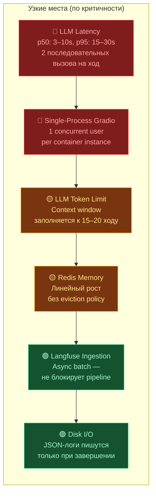
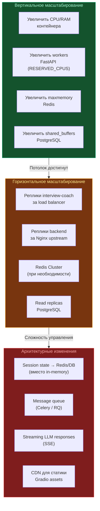

# Spec: Capacity Planning

Спецификация планирования ёмкости для Multi-Agent Interview Coach.

---

## 1. Профиль нагрузки

### 1.1 Единица нагрузки — одна сессия интервью

| Параметр | Значение | Источник |
|---|---|---|
| Средняя длительность | 15–30 минут | Оценка по MAX_TURNS=20 и среднему времени ответа |
| Ходов (turns) | 8–20 | Типичный диапазон; лимит `MAX_TURNS=20` |
| LLM-вызовов на приветствие | 1 (Interviewer greeting) | `InterviewSession.start()` |
| LLM-вызовов на ход | 2 (Observer + Interviewer) | `InterviewSession.process_message()` |
| LLM-вызовов на стоп-команду | 1 (Observer распознаёт STOP_COMMAND) | `ObserverAgent.process()` |
| LLM-вызовов на фидбэк | 1 (Evaluator) | `InterviewSession.generate_feedback()` |
| **Всего LLM-вызовов на сессию** | **2N + 2** до **2N + 3** (при N ходах: 18–43) | Формула: 1 (greeting) + 2×N (ходы) + 1 (evaluator) + 0–1 (stop observer, только при текстовой стоп-команде) |
| Средний расход токенов на сессию | 50 000–80 000 | Оценка: ~2 500–4 000 токенов на LLM-вызов |
| Средний расход токенов на Evaluator | 5 000–8 000 | Полная история + развёрнутый фидбэк |
| Размер JSON-логов на сессию | 50–200 КБ | `interview_log_*.json` + `interview_detailed_*.json` |

### 1.2 Разбивка по агентам (средний расход токенов на один вызов)

| Агент | Input tokens | Output tokens | Всего | Вызовов за сессию | Доля |
|---|---|---|---|---|---|
| **Observer** | 1 200–2 500 | 300–600 | 1 500–3 100 | N (8–20) | ~50% |
| **Interviewer** | 1 500–3 000 | 150–400 | 1 650–3 400 | N + 1 (9–21, с greeting) | ~45% |
| **Evaluator** | 3 500–6 000 | 1 000–2 000 | 4 500–8 000 | 1 | ~5–10% |

> **Примечание**: расход токенов растёт с каждым ходом, так как контекст (история диалога, candidate info, skills) увеличивается. Observer использует сжатую историю (5 последних ходов × 100 символов), Interviewer — полную историю за `HISTORY_WINDOW_TURNS=10` ходов, Evaluator — полную историю всех ходов.

### 1.3 Профили использования

| Профиль | Concurrent users | Sessions/hour | LLM-вызовов/hour | LLM RPS (avg) | LLM RPS (peak) |
|---|---|---|---|---|---|
| **Dev / Demo** | 1 | 2–4 | 40–170 | 0.01–0.05 | 0.1–0.3 |
| **Small team** (5–10 чел.) | 3–5 | 10–20 | 200–860 | 0.06–0.24 | 0.5–1.5 |
| **Production** (50–100 чел.) | 10–30 | 50–200 | 1 000–8 600 | 0.3–2.4 | 5–15 |

**Расчёт LLM RPS**:
- Average: `(sessions/hour × avg_llm_calls_per_session) / 3600`
- Peak: `concurrent_users × 2 / avg_llm_latency` (2 вызова на ход, параллелизация невозможна — вызовы последовательные)

---

## 2. Ресурсы

### 2.1 Compute

#### Контейнер `interview-coach` (Gradio UI + Agents)

| Профиль | CPU | RAM | Примечание |
|---|---|---|---|
| Dev / Demo | 0.5 vCPU | 256–512 МБ | Single-process Gradio, 1 пользователь |
| Small team | 1 vCPU | 512 МБ–1 ГБ | Gradio single-process — bottleneck при >5 concurrent users |
| Production | 2–4 vCPU | 1–2 ГБ | Требуется горизонтальное масштабирование (несколько реплик) |

> **Ключевое ограничение**: Gradio UI работает в single-process режиме. `InterviewSession` (содержащий `InterviewState`) хранится in-memory в глобальной переменной `_current_session`. Это означает, что один экземпляр контейнера обслуживает **одного пользователя** в каждый момент времени. Для concurrent users необходимы отдельные реплики.

#### Контейнер `backend` (FastAPI)

| Профиль | CPU | RAM | Workers | Примечание |
|---|---|---|---|---|
| Dev / Demo | 0.5 vCPU | 256 МБ | 1 | `nproc - RESERVED_CPUS` (min 1) |
| Small team | 1 vCPU | 512 МБ | 1–2 | Gunicorn + Uvicorn workers |
| Production | 2–4 vCPU | 1–2 ГБ | 2–4 | `RESERVED_CPUS=6` по умолчанию, настроить под среду |

#### Контейнер `redis_cache`

| Профиль | CPU | RAM | Примечание |
|---|---|---|---|
| Dev / Demo | 0.1 vCPU | 64 МБ | Минимальная нагрузка |
| Small team | 0.2 vCPU | 128 МБ | Кэш FastAPI backend |
| Production | 0.5 vCPU | 256–512 МБ | Зависит от политики кэширования |

#### Контейнер `langfuse` + `langfuse-db`

| Профиль | Langfuse CPU | Langfuse RAM | PostgreSQL CPU | PostgreSQL RAM |
|---|---|---|---|---|
| Dev / Demo | 0.5 vCPU | 512 МБ | 0.2 vCPU | 256 МБ |
| Small team | 1 vCPU | 1 ГБ | 0.5 vCPU | 512 МБ |
| Production | 2 vCPU | 2 ГБ | 1 vCPU | 1–2 ГБ |

#### Контейнер `nginx`

| Профиль | CPU | RAM | Примечание |
|---|---|---|---|
| Все профили | 0.1 vCPU | 64 МБ | Минимальные требования; Nginx крайне лёгкий |

#### Суммарные требования

| Профиль | Всего CPU | Всего RAM | Примечание |
|---|---|---|---|
| Dev / Demo | 2 vCPU | 1.5 ГБ | Один хост / ноутбук разработчика |
| Small team | 4 vCPU | 4 ГБ | Один сервер |
| Production | 12–16 vCPU | 8–12 ГБ | Кластер / несколько серверов |

> **Внимание**: эти оценки **не включают** LLM backend (Ollama, vLLM и т.д.), который требует значительно больше ресурсов (GPU, 16–64 ГБ VRAM для локальных моделей).

### 2.2 Storage

| Хранилище | Профиль Dev | Профиль Small team | Профиль Production | Ротация |
|---|---|---|---|---|
| **Interview logs** (`interview-logs` volume) | ~10 МБ/мес (100 сессий × 100 КБ) | ~100 МБ/мес (1 000 сессий) | ~2 ГБ/мес (20 000 сессий) | Нет автоматической ротации; ручная очистка |
| **Application logs** (`system.log`, `personal.log`) | 20 МБ max | 20 МБ max | 20 МБ max | `RotatingFileHandler`: 10 МБ × 2 backup |
| **Redis data** (`redis-cache-data` volume) | <10 МБ | <50 МБ | <200 МБ | Volatile; TTL-based eviction |
| **Langfuse PostgreSQL** (`langfuse-db-data` volume) | ~50 МБ/мес | ~500 МБ/мес | ~5 ГБ/мес | Встроенная retention policy Langfuse |
| **Docker images** | ~2 ГБ | ~2 ГБ | ~2 ГБ | `docker system prune` |

#### Рекомендации по disk provisioning

| Профиль | Минимум диска | Рекомендация | Горизонт планирования |
|---|---|---|---|
| Dev / Demo | 10 ГБ | 20 ГБ | Без ограничений |
| Small team | 20 ГБ | 50 ГБ | 6 месяцев |
| Production | 50 ГБ | 200 ГБ | 12 месяцев |

### 2.3 Network

| Направление трафика | Размер на сессию | Профиль Dev | Профиль Small team | Профиль Production |
|---|---|---|---|---|
| **Gradio UI ↔ Браузер** (WebSocket + HTTP) | 100–500 КБ | <1 МБ/ч | <10 МБ/ч | <100 МБ/ч |
| **LLMClient → LiteLLM Proxy** (HTTP JSON) | 5–15 МБ (токены × ~4 байта) | <60 МБ/ч | <300 МБ/ч | <3 ГБ/ч |
| **LangfuseTracker → Langfuse** (HTTP batch) | 500 КБ–2 МБ | <10 МБ/ч | <40 МБ/ч | <400 МБ/ч |
| **Backend ↔ Redis** (TCP) | <10 КБ | <1 МБ/ч | <5 МБ/ч | <50 МБ/ч |
| **Langfuse → PostgreSQL** (TCP) | 500 КБ–2 МБ | <10 МБ/ч | <40 МБ/ч | <400 МБ/ч |

> **Основной потребитель bandwidth**: LLM-запросы. Размер payload растёт с длиной контекста (каждый ход увеличивает input tokens).

---

## 3. Bottlenecks

### 3.1 Ранжирование узких мест

### 3.2 Подробное описание

#### 🔴 LLM Latency (критическое)

**Проблема**: Каждый ход интервью требует 2 последовательных LLM-вызова (Observer → Interviewer). Пользователь ждёт ответа `latency_observer + latency_interviewer`.

| Метрика | Локальная модель (Ollama) | Облачная модель (DeepSeek) |
|---|---|---|
| p50 latency на вызов | 3–8s | 1–3s |
| p95 latency на вызов | 10–20s | 5–10s |
| p50 latency на ход (2 вызова) | 6–16s | 2–6s |
| p95 latency на ход (2 вызова) | 20–40s | 10–20s |
| Evaluator (полный контекст) | 10–30s | 5–15s |

**Митигация**:
- Timeout: `LITELLM_TIMEOUT=120s` предотвращает бесконечное ожидание.
- Circuit breaker: при 5 последовательных сбоях — мгновенный отказ на 60s.
- Retry с exponential backoff: `base=0.5s`, `max=30s`, до 3 попыток.
- Для Production: использовать облачные модели или выделенный GPU-сервер с vLLM.

#### 🔴 Single-Process Gradio (критическое)

**Проблема**: Gradio UI работает в одном процессе. `InterviewSession` (содержащий `InterviewState` и агентов) хранится в глобальной переменной `_current_session`. Два пользователя не могут проводить интервью одновременно в одном контейнере.

**Митигация**:
- Dev / Demo: ограничение на 1 пользователя (достаточно).
- Small team: запуск нескольких реплик `interview-coach` за load balancer.
- Production: полная переработка на session-based архитектуру (state в Redis/DB).

#### 🟡 LLM Token Limit (умеренное)

**Проблема**: контекст растёт с каждым ходом. К 15–20 ходу context window может приближаться к лимиту модели.

| Компонент | Стратегия сжатия | Предел |
|---|---|---|
| Observer | Сжатая история: 5 ходов × 100 символов | ~1 000 токенов |
| Interviewer | Полная история: `HISTORY_WINDOW_TURNS=10` ходов | ~5 000–10 000 токенов |
| Evaluator | Полная история всех ходов | ~15 000–30 000 токенов |

**Митигация**:
- `HISTORY_WINDOW_TURNS` ограничивает окно для Interviewer.
- `MAX_TURNS=20` ограничивает общее количество ходов.
- Для моделей с маленьким context window: уменьшить `MAX_TURNS` и `HISTORY_WINDOW_TURNS`.

#### 🟡 Redis Memory (умеренное)

**Проблема**: Redis используется как кэш FastAPI backend без настроенной eviction policy. При длительной работе память может расти.

**Митигация**:
- Настроить `maxmemory` и `maxmemory-policy allkeys-lru` в Redis.
- Мониторить `redis-cli info memory`.

---

## 4. Scaling Triggers

### 4.1 Автоматические триггеры масштабирования

| Метрика | Порог | Действие | Приоритет |
|---|---|---|---|
| **CPU usage** (контейнер) | > 80% sustained (5 мин) | Горизонтальное масштабирование: добавить реплику | 🔴 Высокий |
| **Memory usage** (контейнер) | > 85% | Вертикальное масштабирование: увеличить RAM лимит | 🔴 Высокий |
| **LLM p95 latency** | > 20s | Оптимизация: смена модели, увеличение GPU, уменьшение MAX_TURNS | 🔴 Высокий |
| **LLM error rate** | > 5% за 5 мин | Расследование: проверка LiteLLM proxy, LLM backend, circuit breaker | 🔴 Высокий |
| **Queue depth** (ожидающие пользователи) | > 3 concurrent | Горизонтальное масштабирование Gradio реплик | 🟡 Средний |
| **Disk usage** (interview-logs) | > 80% volume | Очистка старых логов или расширение volume | 🟡 Средний |
| **PostgreSQL connections** (Langfuse) | > 80% max_connections | Увеличить `max_connections` или добавить connection pooler (PgBouncer) | 🟡 Средний |
| **Redis memory** | > 75% maxmemory | Проверить eviction policy; при необходимости увеличить лимит | 🟢 Низкий |
| **Langfuse ingestion lag** | > 60s | Увеличить ресурсы Langfuse контейнера | 🟢 Низкий |

### 4.2 Стратегии масштабирования

### 4.3 Рекомендуемый порядок масштабирования

| Шаг | Когда | Действие | Сложность |
|---|---|---|---|
| 1 | 1–3 concurrent users | Вертикальное: увеличить CPU/RAM interview-coach | Низкая |
| 2 | 3–10 concurrent users | Горизонтальное: 3–5 реплик interview-coach за Nginx/Traefik | Средняя |
| 3 | 10–30 concurrent users | Архитектурное: session state в Redis; session affinity через cookie | Высокая |
| 4 | 30–100 concurrent users | Архитектурное: message queue для LLM-вызовов; streaming responses | Высокая |
| 5 | 100+ concurrent users | Полный редизайн: микросервисы, Kubernetes, auto-scaling | Очень высокая |

---

## 5. Cost Estimation

### 5.1 Стоимость LLM-вызовов

#### Локальная модель (Ollama / vLLM на собственном GPU)

| Параметр | Значение |
|---|---|
| Стоимость токена | $0 (только CAPEX на оборудование) |
| Стоимость GPU-сервера | $1 000–5 000 (одноразово) или $0.5–2.0/ч (облачный GPU) |
| Стоимость на сессию (70K токенов) | ~$0 (amortized) |

#### Облачная модель (DeepSeek Chat)

| Параметр | Значение |
|---|---|
| Input tokens | ~$0.14 / 1M tokens |
| Output tokens | ~$0.28 / 1M tokens |
| Средняя сессия (50K input + 20K output) | ~$0.013 |
| Evaluator feedback (6K input + 1.5K output) | ~$0.001 |
| **Итого на сессию** | **~$0.01–0.02** |

#### Облачная модель (OpenAI GPT-4o)

| Параметр | Значение |
|---|---|
| Input tokens | ~$2.50 / 1M tokens |
| Output tokens | ~$10.00 / 1M tokens |
| Средняя сессия (50K input + 20K output) | ~$0.33 |
| Evaluator feedback (6K input + 1.5K output) | ~$0.03 |
| **Итого на сессию** | **~$0.30–0.50** |

### 5.2 Стоимость инфраструктуры (помесячная)

| Компонент | Dev / Demo | Small team | Production |
|---|---|---|---|
| **Compute** (VM / bare metal) | $0 (локально) | $20–50/мес (VPS 4 vCPU, 8 ГБ) | $100–300/мес (8–16 vCPU, 16–32 ГБ) |
| **GPU** (для локальных LLM) | $0 (уже есть) | $50–200/мес (cloud GPU) | $200–800/мес (dedicated GPU) |
| **Storage** (SSD) | $0 (локально) | $5–10/мес (50 ГБ SSD) | $20–50/мес (200 ГБ SSD) |
| **LLM API** (облачная модель) | $1–5/мес | $10–50/мес | $100–2 000/мес |
| **Итого** | **$0–5/мес** | **$85–310/мес** | **$420–3 150/мес** |

### 5.3 Стоимость на одного пользователя

| Профиль | Sessions/user/мес | Стоимость LLM/user/мес (DeepSeek) | Стоимость LLM/user/мес (GPT-4o) |
|---|---|---|---|
| Dev / Demo | 20–40 | $0.20–0.80 | $6–20 |
| Small team | 10–20 | $0.10–0.40 | $3–10 |
| Production | 5–15 | $0.05–0.30 | $1.50–7.50 |

---

## 6. Мониторинг и алерты

### 6.1 Ключевые метрики для мониторинга

| Метрика | Источник | Нормальное значение | Алерт |
|---|---|---|---|
| LLM p50 latency | Langfuse generations | < 5s | > 10s |
| LLM p95 latency | Langfuse generations | < 15s | > 20s |
| LLM error rate | Langfuse generations | < 1% | > 5% |
| Sessions/hour | Langfuse traces | Зависит от профиля | > 2× от baseline |
| Tokens/session | Langfuse scores | 50K–80K | > 100K |
| Cost/session | Langfuse scores | $0.01–0.50 | > 2× от среднего |
| Container CPU % | Docker stats | < 60% | > 80% (5 мин) |
| Container Memory % | Docker stats | < 70% | > 85% |
| Redis memory usage | `redis-cli info memory` | < 50% maxmemory | > 75% |
| PostgreSQL connections | `pg_stat_activity` | < 50% max_connections | > 80% |
| Disk usage (volumes) | `df -h` | < 60% | > 80% |
| Circuit breaker state | Application logs | CLOSED | OPEN |

### 6.2 Рекомендуемый стек мониторинга

| Компонент | Инструмент | Назначение |
|---|---|---|
| LLM-метрики | **Langfuse** (уже интегрирован) | Latency, tokens, cost, traces |
| Container-метрики | **Docker stats** / **cAdvisor** | CPU, memory, network per container |
| Инфраструктура | **Prometheus + Grafana** | Сбор и визуализация метрик |
| Алерты | **Grafana Alerting** / **PagerDuty** | Уведомления по порогам |
| Логи | **Loki** / встроенные `system.log` | Агрегация и поиск по логам |

---

## 7. Рекомендации по профилям

### 7.1 Dev / Demo

- Один хост (ноутбук разработчика или VPS).
- Локальная модель через Ollama (бесплатно, но медленно).
- `MAX_TURNS=10` для экономии времени.
- Мониторинг: Langfuse UI для просмотра трейсов.
- Никакого масштабирования не требуется.

### 7.2 Small team

- Выделенный сервер (4+ vCPU, 8+ ГБ RAM).
- Облачная модель (DeepSeek) для скорости и стоимости.
- 2–3 реплики `interview-coach` за reverse proxy с session affinity.
- `MAX_TURNS=15–20`.
- Мониторинг: Langfuse + Docker stats.
- Резервное копирование `langfuse-db-data` и `interview-logs`.

### 7.3 Production

- Кластер (Kubernetes или Docker Swarm).
- Облачная модель с SLA (DeepSeek / OpenAI) или dedicated GPU.
- Session state в Redis (требуется доработка архитектуры).
- Auto-scaling по CPU и queue depth.
- `MAX_TURNS=20`.
- Полный стек мониторинга: Prometheus + Grafana + Loki + Langfuse.
- Automated backups, disaster recovery plan.
- Rate limiting на уровне Nginx.